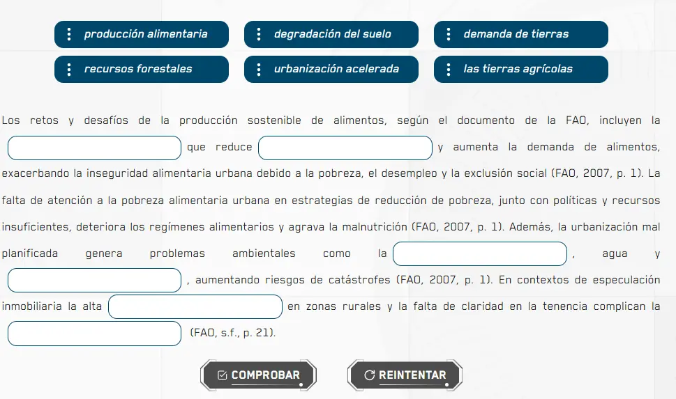

import CoreRepoInfo from '../../../components/CoreRepoInfo.astro';

`DndActivity` es el componente raíz que orquesta la actividad completa. Gestiona el estado global de arrastre, validación y resultados. Se compone de tres subcomponentes: `DragAndDrop.Container`, `DragAndDrop.Drag` y `DragAndDrop.Drop`.

## Vista previa



## Cómo implementar en un OVA

### 1. Importa los componentes

En tu archivo `.tsx` del OVA importa todo lo necesario:

```tsx
import { useRef, useState } from 'react';
import { DragAndDrop, Row } from 'books-ui';
import { DndActivity } from '@activities/dnd-activity';
import { useGamification } from '@features/gamification';
import { ToastFeedback } from '@features/toast-feedback';
import { Content } from '@layouts';
import { Button } from '@ui';
import { currentParagraph } from '@shared/utils/current-paragraph';
```

---

### 2. Define las constantes

Declara los identificadores de los modales y la cantidad total de respuestas correctas:

```tsx
const MODALS = {
  SUCCESS: 'modal-correct-activity',
  WRONG: 'modal-wrong-activity'
};

const LENGTH_QUESTION = 6; // total de espacios en blanco
```

---

### 3. Configura los hooks

Dentro del componente inicializa el ref del párrafo y el hook de gamificación:

```tsx
const refTextWrapperUno = useRef<HTMLDivElement>(null);
const [isOpen, setIsOpen] = useState<string | null>(null);

const { Modal, Stars, notifyReset, reportResult } = useGamification({
  id: 'ova-01-activity-1', // ID único por OVA
  total: 1
});
```

:::tip[El `id` de gamificación debe ser único por actividad]
Cada actividad del proyecto debe tener un `id` diferente. Usa el patrón `ova-[número]-activity-[número]` para mantener consistencia.
:::

---

### 4. Crea el handler de validación

Esta función recibe el resultado de `DndActivity` y abre el modal correspondiente:

```tsx
const handleValidate = ({ result }: { result: boolean }) => {
  const activityResult = result ? 'SUCCESS' : 'WRONG';
  setIsOpen(MODALS[activityResult as keyof typeof MODALS]);

  reportResult({
    success: result,
    correct: LENGTH_QUESTION,
    total: LENGTH_QUESTION
  });
};

const closeModal = () => setIsOpen(null);
```

---

### 5. Construye la actividad

Dentro del `return`, arma el `DndActivity` con sus tres partes:

**5a. Banco de palabras** — todos los ítems arrastrables dentro de `DragAndDrop.Container`:

```tsx
<DragAndDrop.Container id="general-1" label="Conjunto de palabras" addClass="u-grid u-grid-cols-3">
  <DragAndDrop.Drag id="01" label="producción alimentaria">
    <span>producción alimentaria</span>
  </DragAndDrop.Drag>
  <DragAndDrop.Drag id="02" label="degradación del suelo">
    <span>degradación del suelo</span>
  </DragAndDrop.Drag>
  {/* ...más ítems */}
</DragAndDrop.Container>
```

> El `id` de cada `Drag` es clave — es el valor que usa `validate` en los `Drop`.

**5b. Párrafo con zonas** — el texto con los `DragAndDrop.Drop` intercalados:

```tsx
<span ref={refTextWrapperUno} className="u-text-justify u-leading-loose u-block u-m-3">
  El texto introductorio incluyen la
  <DragAndDrop.Drop id="drop1-1" validate={['05']} label="primer espacio" addClass="u-mx-1" />
  que reduce
  <DragAndDrop.Drop id="drop1-2" validate={['06']} label="segundo espacio" addClass="u-mx-1" />
  y aumenta la demanda...
</span>
```

> `validate={['05']}` significa que el Drop acepta como correcta la palabra con `id="05"`.

**5c. Botones de acción:**

```tsx
<Row justifyContent="center" alignItems="center" addClass="u-gap-x-6">
  <DndActivity.Button>
    <Button label="Comprobar" variant="check" />
  </DndActivity.Button>
  <DndActivity.Button type="reset">
    <Button label="Reintentar" variant="reset" onClick={notifyReset} />
  </DndActivity.Button>
</Row>
```

---

### 6. Conecta todo en DndActivity

Envuelve las tres partes con el componente raíz:

```tsx
<DndActivity
  id="ova-08-dnd-1"
  minCorrectDrags={6}
  announcements={() =>
    currentParagraph({ id: 'paragraph-activity', container: refTextWrapperUno?.current })
  }
  onResult={handleValidate}>

  {/* 5a. Banco */}
  {/* 5b. Párrafo */}
  {/* 5c. Botones */}

</DndActivity>
```

---

### 7. Agrega los modales de feedback

Fuera del `Content`, agrega el `Modal` de gamificación y los dos `ToastFeedback`:

```tsx
{/* Modal de éxito (gamificación) */}
<Modal audio="assets/audios/content/aud_gr1_ova-8_sld-4 (Bien).mp3" />

{/* Toast incorrecto */}
<ToastFeedback
  type="wrong"
  isOpen={isOpen === MODALS.WRONG}
  onClose={closeModal}
  interpreter={{ contentURL: 'vid_int_ova-08_sld-4 (Incorrecto).mp4' }}
  audio="assets/audios/content/aud_gr1_ova-8_sld-4 (Incorrecto).mp3">
  <div className="u-flow">
    <p><strong>Palabra 1:</strong> Explicación de por qué va ahí.</p>
    {/* ...explicación de cada respuesta */}
  </div>
</ToastFeedback>

{/* Toast correcto */}
<ToastFeedback
  type="success"
  isOpen={isOpen === MODALS.SUCCESS}
  onClose={closeModal}
  interpreter={{ contentURL: 'vid_int_ova-08_sld-4 (Correcto).mp4' }}
  audio="assets/audios/content/aud_gr1_ova-8_sld-4 (Correcto).mp3">
  <p>Has realizado un muy buen trabajo.</p>
</ToastFeedback>
```

---

## Props de DndActivity

| Prop | Tipo | Req. | Descripción |
|---|---|---|---|
| `id` | `string` | ✓ | Identificador único de la actividad (ej: `"ova-08-dnd-1"`) |
| `minCorrectDrags` | `number` | | Mínimo de arrastres correctos para superar la actividad |
| `announcements` | `() => void` | | Función para anuncios de accesibilidad (lectores de pantalla) |
| `onResult` | `(result) => void` | | Callback al comprobar. Recibe el resultado de la validación |

<CoreRepoInfo corePath="components/activities/dnd-activity/dnd.tsx" />

## Props de DragAndDrop.Container

| Prop | Tipo | Req. | Descripción |
|---|---|---|---|
| `id` | `string` | ✓ | Identificador único del contenedor |
| `label` | `string` | | Etiqueta accesible del grupo |
| `addClass` | `string` | | Clases utilitarias (ej: `"u-grid u-grid-cols-3"`) |

## Props de DragAndDrop.Drag

| Prop | Tipo | Req. | Descripción |
|---|---|---|---|
| `id` | `string` | ✓ | Identificador único del elemento arrastrable |
| `label` | `string` | | Texto accesible del ítem |

## Props de DragAndDrop.Drop

| Prop | Tipo | Req. | Descripción |
|---|---|---|---|
| `id` | `string` | ✓ | Identificador único de la zona de destino |
| `validate` | `string[]` | ✓ | IDs de `Drag` aceptados como respuesta correcta |
| `label` | `string` | | Etiqueta accesible del espacio vacío |
| `addClass` | `string` | | Clases utilitarias (ej: `"u-mx-1"`) |


## Props de DndActivity.Button

| Prop | Tipo | Req. | Descripción |
|---|---|---|---|
| `type` | `"reset"` | | Sin valor actúa como "Comprobar". Con `"reset"` reinicia el estado completo |

<CoreRepoInfo corePath="components/activities/dnd-activity/dnd-buttons.tsx" />

## Flujo de validación

1. El usuario arrastra ítems de `DragAndDrop.Container` hacia los `DragAndDrop.Drop` del texto.
2. Al pulsar **Comprobar**, `DndActivity` evalúa cada zona contra su prop `validate`.
3. Si el número de zonas correctas alcanza `minCorrectDrags`, se llama `onResult` con resultado positivo.
4. **Reintentar** limpia todas las zonas y devuelve los ítems al banco.

## Accesibilidad

Usa `announcements` para conectar un lector de párrafo que informe a tecnologías asistivas el contexto del texto cuando el foco cambia entre zonas de arrastre.

```tsx
announcements={() =>
  currentParagraph({ id: 'paragraph-activity', container: refTextWrapperUno?.current })
}
```