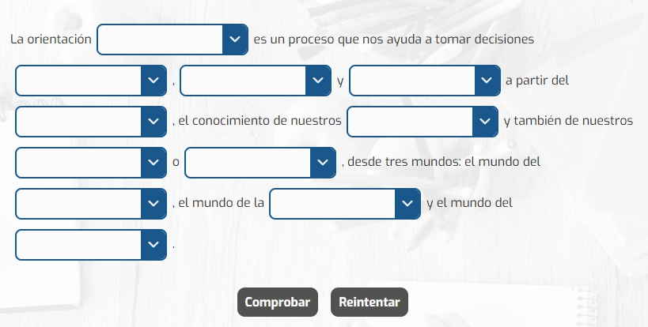

import CoreRepoInfo from '../../../components/CoreRepoInfo.astro';

`Inputs` es el componente raíz utilizado para actividades de rellenar huecos o escribir respuestas libres cortas que serán confrontadas contra un arreglo de opciones válidas. Como componente contendor gestiona el estado, coordina los inputs hijos y dictamina el resultado. Se compone de los subcomponentes `Inputs.Input` e `Inputs.Button`.

## Vista previa



## Cómo implementar en un OVA

### 1. Importa los componentes

```tsx
import { useState } from 'react';
import { Inputs } from '@activities/input-activity';
import { useGamification } from '@features/gamification';
import { ToastFeedback } from '@features/toast-feedback';
import { Row } from 'books-ui';
import { Button } from '@ui';
```

---

### 2. Define las constantes

```tsx
const MODALS = {
  SUCCESS: 'modal-correct-activity',
  WRONG: 'modal-wrong-activity'
};

const LENGTH_QUESTION = 2; // total de inputs o campos a rellenar
```

---

### 3. Configura los hooks

```tsx
const [isOpen, setIsOpen] = useState<string | null>(null);

const { Modal, notifyReset, reportResult } = useGamification({
  id: 'ova-01-typing-1',
  total: LENGTH_QUESTION
});
```

:::tip[El `id` de gamificación debe ser único por actividad]
Cada actividad del proyecto debe tener un `id` diferente. Usa el patrón `ova-[número]-activity-[número]` para mantener consistencia.
:::

---

### 4. Crea el handler de validación

```tsx
const handleValidate = ({ result }: { result: boolean }) => {
  const activityResult = result ? 'SUCCESS' : 'WRONG';
  setIsOpen(MODALS[activityResult as keyof typeof MODALS]);

  reportResult({
    success: result,
    correct: result ? LENGTH_QUESTION : 0, 
    total: LENGTH_QUESTION
  });
};

const closeModal = () => setIsOpen(null);
```

---

### 5. Construye la actividad

La actividad incluye texto de lectura y fragmentos de `Inputs.Input` intercalados donde sea requerido:

```tsx
<Inputs onResult={handleValidate}>
  <p className="u-mb-4">
    Complete los siguientes espacios en blanco:
  </p>

  <div className="u-flow u-ml-4">
    <p>
      1. El país más grande de Sudamérica es {' '}
      <Inputs.Input 
        id="inp-1"
        name="q1"
        correctAnswers={['Brasil', 'brasil']} 
        addClass="u-w-32" 
      />.
    </p>
    <p>
      2. La capital de Japón es {' '}
      <Inputs.Input 
        id="inp-2"
        name="q2"
        correctAnswers={['Tokio', 'tokio']} 
        addClass="u-w-32" 
      />.
    </p>
  </div>

  <Row justifyContent="center" alignItems="center" addClass="u-gap-4 u-mt-8">
    <Inputs.Button>
      <Button label="COMPROBAR" variant="check" />
    </Inputs.Button>
    <Inputs.Button type="reset">
      <Button label="REINICIAR" onClick={notifyReset} variant="reset" />
    </Inputs.Button>
  </Row>
</Inputs>
```

> La prop `correctAnswers` es un arreglo, lo cual permite añadir múltiples validaciones permisivas para un mismo hueco (ej. con o sin tilde). La validación principal requiere que *absolutamente todos* los inputs coincidan con alguna de sus respuestas correctas proporcionadas para marcar la actividad como aprobada.

---

### 6. Agrega los modales de feedback

```tsx
<Modal
  audio="assets/audios/content/aud_bien.mp3"
/>

<ToastFeedback
  type="wrong"
  isOpen={isOpen === MODALS.WRONG}
  onClose={closeModal}
  audio="assets/audios/content/aud_incorrecto.mp3">
  <p>Revisa nuevamente. ¡Las respuestas a los conceptos no son las correctas!</p>
</ToastFeedback>

<ToastFeedback
  type="success"
  isOpen={isOpen === MODALS.SUCCESS}
  onClose={closeModal}
  audio="assets/audios/content/aud_correcto.mp3">
  <p>¡Buen trabajo! Has completado las informaciones de manera correcta.</p>
</ToastFeedback>
```

---

## Props de Inputs

| Prop | Tipo | Req. | Descripción |
|---|---|---|---|
| `onResult` | `({ result: boolean, inputs: Input[] }) => void` | | Función callback llamada al realizar la validación general de toda la actividad. |

<CoreRepoInfo corePath="components/activities/input-activity/input-activity.tsx" />

## Props de Inputs.Input

Este elemento inyecta nativamente la etiqueta de recolección de entradas (`<input type="text">`).

| Prop | Tipo | Req. | Descripción |
|---|---|---|---|
| `id` | `string` | | Identificador único de este campo (opcional, autocreado si se ignora). |
| `name` | `string` | ✓ | Nombre o key que identifica la parte de un formulario en específico. |
| `correctAnswers` | `string[]` | ✓ | Conjunto de respuestas aceptadas y evaluadas como correctas para el estudiante. (Procura coincidir exactitudes sin dejar espacios sobrantes). |
| `addClass` | `string` | | Útil para aplicar tamaños o fuentes específicas integrando utilitarios. |

<CoreRepoInfo corePath="components/activities/input-activity/input-element.tsx" />

## Props de Inputs.Button

| Prop | Tipo | Req. | Descripción |
|---|---|---|---|
| `type` | `"reset"` | | Dejar sin valor actúa en concordancia para el sometimiento (Comprobar). Si posee `"reset"`, borrará tanto lo escrito como sus estados e indicadores de error o acierto. |

<CoreRepoInfo corePath="components/activities/input-activity/input-button.tsx" />