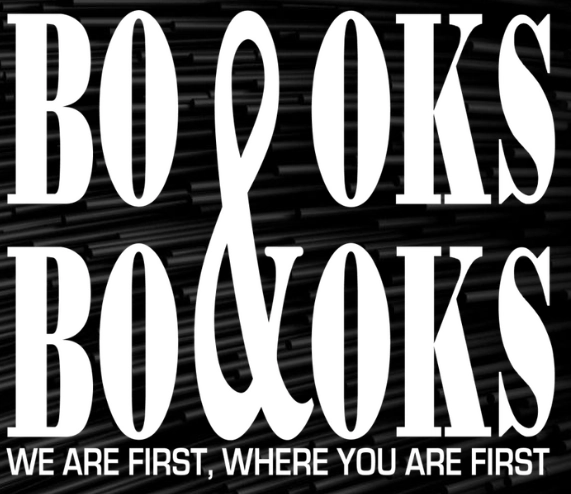

`PairLogicActivity` permite conectar imágenes con bloques de texto. Es ideal para relacionar procesos, identificar elementos visuales o asociar conceptos con sus representaciones gráficas.

## Vista previa



## Cómo implementar en un OVA

### 1. Importa los componentes

```tsx
import { useState } from 'react';
import { PairLogicActivity } from '@shared/components/activities';
import { useGamification } from '@shared/store/gamification-store';
import { ToastFeedback } from '@shared/components/ui';
import { Button } from '@shared/components/ui';
```

---

### 2. Define las constantes y estados

```tsx
const MODALS = {
  TRUE: 'modal-correct',
  FALSE: 'modal-wrong'
};

const [isOpen, setIsOpen] = useState<string | null>(null);

const { reportResult, notifyReset } = useGamification({
  id: 'ova-01-activityPair-1',
  total: 1
});

// El ID de enlace debe ser el mismo para la imagen y el texto correcto
const pairs = [
  { id: '1', img: 'assets/img1.png', text: 'Concepto A' },
  { id: '2', img: 'assets/img2.png', text: 'Concepto B' }
];
```

:::tip[El `id` de gamificación debe ser único por actividad]
Cada actividad del proyecto debe tener un `id` diferente. Usa el patrón `ova-[número]-activity-[número]` para mantener consistencia.
:::

---

### 3. Crea el handler de validación

```tsx
const handleValidate = ({ result, correctCount, total }: any) => {
  setIsOpen(result ? MODALS.TRUE : MODALS.FALSE);

  reportResult({
    success: result,
    correct: correctCount,
    total: total
  });
};

const closeModal = () => setIsOpen(null);
```

---

### 4. Construye la actividad

```tsx
<PairLogicActivity onResult={handleValidate}>
  <div className="u-grid u-grid-cols-2 u-gap-6">
    {/* Columna de Imágenes */}
    <div className="u-space-y-4">
      {pairs.map(p => (
        <PairLogicActivity.Images 
          key={p.id}
          src={p.img} 
          alt={`Imagen ilustrativa de ${p.text}`} 
          join={p.id} 
        />
      ))}
    </div>
    
    {/* Columna de Textos */}
    <div className="u-space-y-4">
      {[...pairs].reverse().map(p => (
        <PairLogicActivity.Items 
          key={p.id}
          text={p.text} 
          join={p.id} 
        />
      ))}
    </div>
  </div>

  <div className="u-flex u-justify-center u-gap-4 u-mt-8">
    <PairLogicActivity.Button>
      <Button label="COMPROBAR PAREJA" variant="check" />
    </PairLogicActivity.Button>
    
    <PairLogicActivity.Button type="reset">
      <Button label="REINICIAR" onClick={notifyReset} variant="reset" />
    </PairLogicActivity.Button>
  </div>
</PairLogicActivity>
```

---

### 5. Agrega los modales de feedback

```tsx
<ToastFeedback
  type="success"
  isOpen={isOpen === MODALS.TRUE}
  onClose={closeModal}
  title="¡Muy bien!"
>
  <p>Has relacionado todos los conceptos correctamente.</p>
</ToastFeedback>

<ToastFeedback
  type="wrong"
  isOpen={isOpen === MODALS.FALSE}
  onClose={closeModal}
  title="Inténtalo de nuevo"
>
  <p>Algunas parejas no coinciden. Revisa la información.</p>
</ToastFeedback>
```

---

## Parámetros

### `PairLogicActivity.Images`

| Prop | Tipo | Descripción |
|---|---|---|
| `src` | `string` | Ruta de la imagen. |
| `alt` | `string` | Texto descriptivo para accesibilidad. |
| `join` | `string` | ID único que vincula la imagen con su texto. |

### `PairLogicActivity.Items`

| Prop | Tipo | Descripción |
|---|---|---|
| `text` | `string` | Texto que describe el concepto. |
| `join` | `string` | ID único que vincula el texto con su imagen. |
| `imageAlt` | `string` | (Opcional) Alt de la imagen para reporte vocal. |

