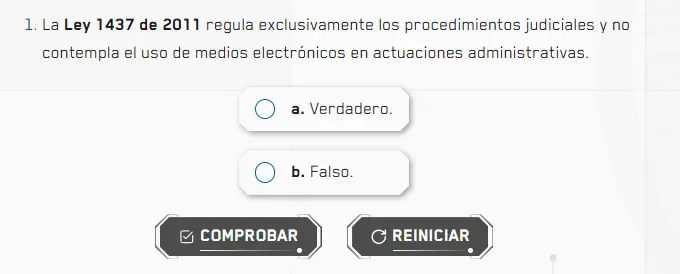

`Radios` es el componente raíz para crear preguntas de selección única o verdadero/falso. Gestiona el estado de selección, validación y resultado de cada pregunta. Se compone de dos subcomponentes: `Radios.Radio` y `Radios.Button`.

## Vista previa
 


## Cómo implementar en un OVA

### 1. Importa los componentes

```tsx
import { useState } from 'react';
import { Radios } from '@activities/radio-activity';
import { useGamification } from '@features/gamification';
import { ToastFeedback } from '@features/toast-feedback';
import { Button } from '@ui';
```

---

### 2. Define las constantes

```tsx
const MODALS = {
  SUCCESS: 'modal-correct-activity',
  WRONG: 'modal-wrong-activity'
};

const LENGTH_QUESTION = 5; // total de preguntas
```

---

### 3. Configura los hooks

```tsx
const [isOpen, setIsOpen] = useState<string | null>(null);

const { Modal, Stars, notifyReset, reportResult } = useGamification({
  id: 'ova-11-activity-1',
  total: LENGTH_QUESTION
});
```

---

### 4. Crea el handler de validación

```tsx
const handleValidate = ({ result }: { result: boolean }) => {
  const activityResult = result ? 'SUCCESS' : 'WRONG';
  setIsOpen(MODALS[activityResult as keyof typeof MODALS]);

  reportResult({
    success: result,
    correct: LENGTH_QUESTION,
    total: LENGTH_QUESTION
  });
};

const closeModal = () => setIsOpen(null);
```

---

### 5. Construye la pregunta

Cada pregunta es un `<Radios>` independiente con sus opciones:

```tsx
<Radios onResult={handleValidate}>
  <div className="u-grid" style={{ '--grid-min': '1fr' } as React.CSSProperties}>
    <Radios.Radio id="option-1-1" state="wrong"   label="a. Verdadero." name="option-1" />
    <Radios.Radio id="option-1-2" state="success" label="b. Falso."     name="option-1" />
  </div>
  <Row justifyContent="center" alignItems="center" addClass="u-gap-4">
    <Radios.Button>
      <Button label="COMPROBAR" variant="check" />
    </Radios.Button>
    <Radios.Button type="reset">
      <Button label="REINICIAR" onClick={notifyReset} variant="reset" />
    </Radios.Button>
  </Row>
</Radios>
```

> `state="success"` marca la opción correcta. `state="wrong"` marca las incorrectas. El `name` debe ser único por pregunta.

---

### 6. Agrega los modales de feedback

Fuera del layout principal, agrega el `Modal` y los dos `ToastFeedback`:

```tsx
<Modal
  audio="assets/audios/content/aud_gr1_ova-11_sld-4 (Bien).mp3"
  interpreter={{ contentURL: 'content/vid_int_ova-11_sld-4 (Bien).mp4' }}
/>

<ToastFeedback
  type="wrong"
  isOpen={isOpen === MODALS.WRONG}
  onClose={closeModal}
  interpreter={{ contentURL: 'content/vid_int_ova-11_sld-4 (Incorrecto).mp4' }}
  audio="assets/audios/content/aud_gr1_ova-11_sld-4 (Incorrecto).mp3">
  <p>Repase el contenido sugerido para comprender los temas de una manera más clara.</p>
</ToastFeedback>

<ToastFeedback
  type="success"
  isOpen={isOpen === MODALS.SUCCESS}
  onClose={closeModal}
  interpreter={{ contentURL: 'content/vid_int_ova-11_sld-4 (Correcto).mp4' }}
  audio="assets/audios/content/aud_gr1_ova-11_sld-4 (Correcto).mp3">
  <p>¡Muy bien! Está listo para el siguiente nivel.</p>
</ToastFeedback>
```

---

## Props de Radios

| Prop | Tipo | Req. | Descripción |
|---|---|---|---|
| `onResult` | `({ result: boolean }) => void` | ✓ | Callback al comprobar. Recibe si la respuesta es correcta |

## Props de Radios.Radio

| Prop | Tipo | Req. | Descripción |
|---|---|---|---|
| `id` | `string` | ✓ | Identificador único de la opción |
| `name` | `string` | ✓ | Agrupa las opciones de una misma pregunta |
| `label` | `string` | ✓ | Texto visible de la opción |
| `state` | `"success" \| "wrong"` | ✓ | Marca si la opción es correcta o incorrecta |

## Props de Radios.Button

| Prop | Tipo | Req. | Descripción |
|---|---|---|---|
| `type` | `"reset"` | | Sin valor actúa como "Comprobar". Con `"reset"` reinicia la pregunta |