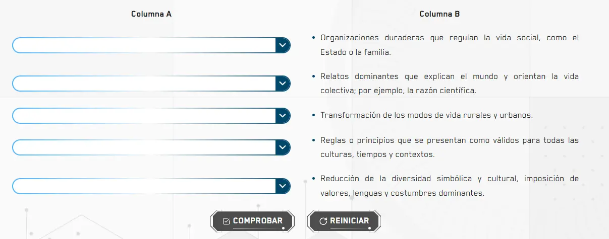

`Selects` es el componente raíz para crear actividades de relacionar columnas mediante menús desplegables. Gestiona el estado de selección, validación y resultado de todas las respuestas. Se compone de dos subcomponentes: `Selects.Select` y `Selects.Button`.

## Vista previa



## Cómo implementar en un OVA

### 1. Importa los componentes

```tsx
import { useState } from 'react';
import { Selects } from '@activities/select-activity';
import { useGamification } from '@features/gamification';
import { ToastFeedback } from '@features/toast-feedback';
import { Button } from '@ui';
```

---

### 2. Define las opciones y constantes

```tsx
const MODALS = {
  TRUE: 'modal-correct-activity',
  FALSE: 'modal-wrong-activity'
};

const LENGTH_QUESTION = 5; // total de selectores

const options = [
  { id: 'option-1', option: 'Narrativas unificadas' },
  { id: 'option-2', option: 'Urbanización y división del trabajo' },
  { id: 'option-3', option: 'Discurso normativo unificado' },
  { id: 'option-4', option: 'Homogeneidad cultural' },
  { id: 'option-5', option: 'Estructuras sociales' }
];
```

> El array `options` es compartido por todos los `Selects.Select`. Cada uno muestra las mismas opciones pero tiene su propia respuesta correcta.

---

### 3. Configura los hooks

```tsx
const [isOpen, setIsOpen] = useState<string | null>(null);

const { Modal, Stars, notifyReset, reportResult } = useGamification({
  id: 'ova-01-activity-2',
  total: 1
});
```

:::tip[El `id` de gamificación debe ser único por actividad]
Cada actividad del proyecto debe tener un `id` diferente. Usa el patrón `ova-[número]-activity-[número]` para mantener consistencia.
:::

---

### 4. Crea el handler de validación

```tsx
const handleValidate = ({ result }: { result: boolean }) => {
  const activityResult = result.toString().toUpperCase();
  setIsOpen(MODALS[activityResult as keyof typeof MODALS]);

  reportResult({
    success: result,
    correct: LENGTH_QUESTION,
    total: LENGTH_QUESTION
  });
};

const closeModal = () => setIsOpen(null);
```

> A diferencia de `Radios`, aquí `result.toString().toUpperCase()` convierte el booleano a `"TRUE"` o `"FALSE"` para coincidir con las keys de `MODALS`.

---

### 5. Construye la actividad

Usa un grid de dos columnas — la columna A tiene los selectores y la B el texto descriptivo:

```tsx
<Selects onResult={handleValidate}>
  <div className="u-grid" style={{ alignItems: 'center', '--grid-min': '24rem' } as React.CSSProperties}>
    <h2>Columna A</h2>
    <h2>Columna B</h2>

    <Selects.Select options={options} correctAnswer="option-5" label="Primer concepto" name="concepto-01" />
    <ul className="u-text-justify u-m-0">
      <li>Organizaciones duraderas que regulan la vida social, como el Estado o la familia.</li>
    </ul>

    <Selects.Select options={options} correctAnswer="option-1" label="Segundo concepto" name="concepto-02" />
    <ul className="u-text-justify u-m-0">
      <li>Relatos dominantes que explican el mundo y orientan la vida colectiva.</li>
    </ul>

    {/* ...más pares selector + descripción */}
  </div>

  <Row justifyContent="center" alignItems="center" addClass="u-gap-4">
    <Selects.Button>
      <Button label="COMPROBAR" variant="check" />
    </Selects.Button>
    <Selects.Button type="reset">
      <Button label="REINICIAR" onClick={notifyReset} variant="reset" />
    </Selects.Button>
  </Row>
</Selects>
```

> `correctAnswer` debe coincidir exactamente con el `id` de una opción del array `options`. El `name` debe ser único por selector.

---

### 6. Agrega los modales de feedback

```tsx
<Modal audio="assets/audios/content/aud_gr1_ova-126_sld-11 (Bien).mp3" />

<ToastFeedback
  type="success"
  isOpen={isOpen === MODALS.TRUE}
  onClose={closeModal}
  interpreter={{ contentURL: 'vid_int_ova-126_sld-11 (Correcto).mp4' }}
  audio="assets/audios/content/aud_gr1_ova-126_sld-11 (Correcto).mp3">
  <p>¡Muy bien! Relacionaste correctamente todos los conceptos.</p>
</ToastFeedback>

<ToastFeedback
  type="wrong"
  isOpen={isOpen === MODALS.FALSE}
  onClose={closeModal}
  interpreter={{ contentURL: 'vid_int_ova-126_sld-11 (Incorrecto).mp4' }}
  audio="assets/audios/content/aud_gr1_ova-126_sld-11 (Incorrecto).mp3">
  <p>Revisa las relaciones e intenta de nuevo.</p>
</ToastFeedback>
```

---

## Subcomponentes

### `Selects`

Contenedor raíz. Gestiona el estado de todos los selectores y dispara la validación al pulsar Comprobar.

| Prop | Tipo | Req. | Descripción |
|---|---|---|---|
| `onResult` | `({ result: boolean }) => void` | ✓ | Callback al comprobar. Recibe `true` si todos los selectores tienen la respuesta correcta |

---

### `Selects.Select`

Menú desplegable individual. Cada uno representa una fila de la columna A.

| Prop | Tipo | Req. | Descripción |
|---|---|---|---|
| `options` | `{ id: string; option: string }[]` | ✓ | Lista de opciones disponibles. Compartida entre todos los selectores |
| `correctAnswer` | `string` | ✓ | `id` de la opción correcta para este selector |
| `label` | `string` | ✓ | Etiqueta accesible del selector |
| `name` | `string` | ✓ | Identificador único del selector. Debe ser distinto en cada fila |

---

### `Selects.Button`

Botón de acción dentro del bloque. Siempre debe ir dentro de `<Selects>`.

| Prop | Tipo | Req. | Descripción |
|---|---|---|---|
| `type` | `"reset"` | | Sin valor actúa como Comprobar y dispara `onResult`. Con `"reset"` limpia todas las selecciones |