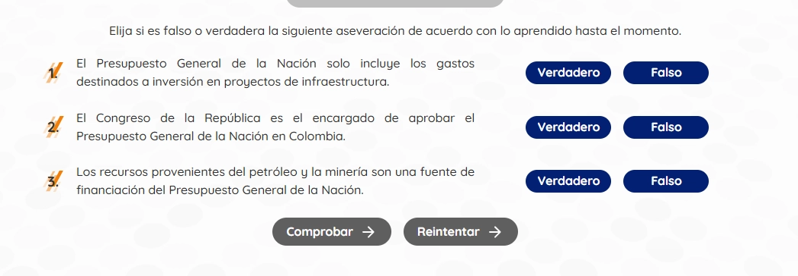

`TableTrueFalseActivity` permite presentar múltiples afirmaciones en una tabla, donde cada fila corresponde a una pregunta con sus columnas de Verdadero y Falso.

## Vista previa



## Cómo implementar en un OVA

### 1. Importa los componentes

```tsx
import { useState } from 'react';
import { TableTrueFalseActivity } from '@shared/components/activities';
import { useGamification } from '@shared/store/gamification-store';
import { ToastFeedback } from '@shared/components/ui';
import { Button } from '@shared/components/ui';
```

---

### 2. Define las opciones y el estado

```tsx
const MODALS = {
  TRUE: 'modal-correct',
  FALSE: 'modal-wrong'
};

const [isOpen, setIsOpen] = useState<string | null>(null);

const questions = [
  { id: 'q1', label: 'El sol es una estrella.', correct: true },
  { id: 'q2', label: 'La luna tiene luz propia.', correct: false },
  { id: 'q3', label: 'El agua hierve a 100°C.', correct: true }
];

const { reportResult, notifyReset } = useGamification({
  id: 'ova-01-activity-1',
  total: 1
});
```

:::tip[El `id` de gamificación debe ser único por actividad]
Cada actividad del proyecto debe tener un `id` diferente. Usa el patrón `ova-[número]-activity-[número]` para mantener consistencia.
:::

---

### 3. Crea el handler de validación

```tsx
const handleValidate = ({ result, correctCount, options }: any) => {
  setIsOpen(result ? MODALS.TRUE : MODALS.FALSE);

  reportResult({
    success: result,
    correct: correctCount,
    total: options.length
  });
};

const closeModal = () => setIsOpen(null);
```

---

### 4. Construye la actividad

```tsx
<TableTrueFalseActivity options={questions} onResult={handleValidate}>
  <table className="u-table">
    <thead>
      <tr>
        <th>Enunciados</th>
        <th>V</th>
        <th>F</th>
      </tr>
    </thead>
    <tbody>
      {questions.map((q) => (
        <tr key={q.id}>
          <td>{q.label}</td>
          <td><TableTrueFalseActivity.Option id={q.id} value={true} /></td>
          <td><TableTrueFalseActivity.Option id={q.id} value={false} /></td>
        </tr>
      ))}
    </tbody>
  </table>

  <div className="u-flex u-justify-center u-gap-4 u-mt-8">
    <TableTrueFalseActivity.Button>
      <Button label="COMPROBAR" variant="check" />
    </TableTrueFalseActivity.Button>
    
    <TableTrueFalseActivity.Button type="reset">
      <Button label="REINICIAR" onClick={notifyReset} variant="reset" />
    </TableTrueFalseActivity.Button>
  </div>
</TableTrueFalseActivity>
```

---

### 5. Agrega los modales de feedback

```tsx
<ToastFeedback
  type="success"
  isOpen={isOpen === MODALS.TRUE}
  onClose={closeModal}
>
  <p>¡Excelente trabajo! Has respondido todo correctamente.</p>
</ToastFeedback>

<ToastFeedback
  type="wrong"
  isOpen={isOpen === MODALS.FALSE}
  onClose={closeModal}
>
  <p>Revisa tus respuestas y vuelve a intentarlo.</p>
</ToastFeedback>
```

---

## Parámetros

### `TableTrueFalseActivity`

| Prop | Tipo | Descripción |
|---|---|---|
| `options` | `Option[]` | Arreglo con la configuración de las preguntas `{ id, label, correct }`. |
| `onResult` | `Function` | Callback al validar la actividad. |

### `TableTrueFalseActivity.Option`

| Prop | Tipo | Descripción |
|---|---|---|
| `id` | `string` | ID que debe coincidir con alguna pregunta del arreglo de `options`. |
| `value` | `boolean` | Valor (V/F) que representa este botón. |

