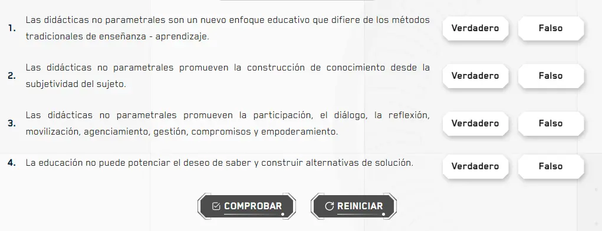
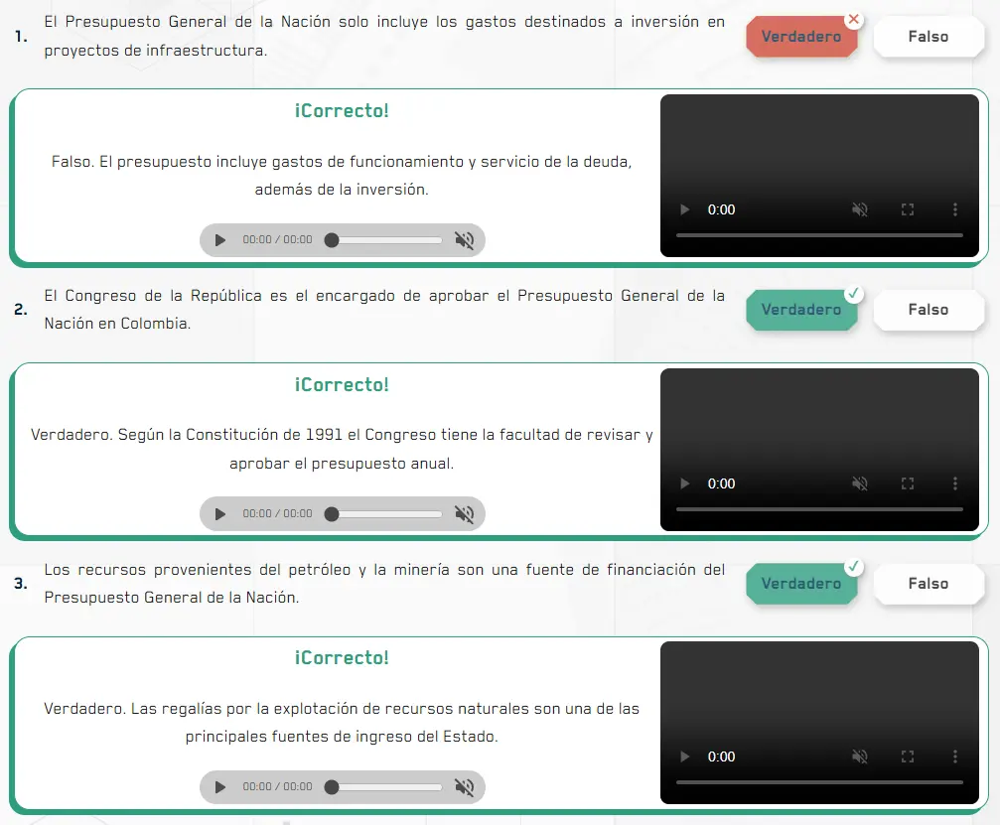

`TableTrueFalseActivity` es el componente raíz para crear actividades donde el estudiante evalúa una lista de afirmaciones marcando cada una como verdadera o falsa. Gestiona el estado de selección, validación y resultado. Se compone de tres subcomponentes: `TableTrueFalseActivity.Option`, `TableTrueFalseActivity.Feedback` y `TableTrueFalseActivity.Button`.

:::note[Dos variaciones según el nivel de retroalimentación]
`TableTrueFalseActivity` tiene dos formas de uso:
- **Sin `Feedback`** — más simple. Solo muestra el resultado global al comprobar. Ideal cuando no necesitas explicar cada respuesta.
- **Con `Feedback`** — más completa. Muestra retroalimentación individual por cada afirmación con audio e intérprete. Ideal cuando quieres explicar por qué cada respuesta es correcta o incorrecta.
:::

## Vista previa

### Variación A — Sin retroalimentación individual

Lista de afirmaciones con botones Verdadero y Falso por fila. Al comprobar muestra solo el resultado global.



### Variación B — Con retroalimentación individual

Después de comprobar, cada afirmación despliega su propia retroalimentación con texto explicativo, audio e intérprete.



## Cómo implementar en un OVA

### 1. Importa los componentes

```tsx
import { useState } from 'react';
import { TableTrueFalseActivity } from '@activities/table-true-false-activity';
import { useGamification } from '@features/gamification';
import { ToastFeedback } from '@features/toast-feedback';
import { Button } from '@ui';
```

---

### 2. Define las opciones y constantes

Las opciones se definen fuera del componente como un array. Cada ítem tiene un `id`, el texto de la afirmación en `label` y si es correcta con `correct`:

```tsx
const MODALS = {
  SUCCESS: 'modal-correct-activity',
  WRONG: 'modal-wrong-activity'
};

const LENGTH_QUESTION = 1;

const options = [
  { id: '1', label: 'El sol es una estrella.',           correct: true  },
  { id: '2', label: 'La luna tiene luz propia.',         correct: false },
  { id: '3', label: 'El agua hierve a 100°C a nivel del mar.', correct: true  }
];
```

---

### 3. Configura los hooks

```tsx
const [isOpen, setIsOpen] = useState<string | null>(null);

const { Modal, Stars, notifyReset, reportResult } = useGamification({
  id: 'ova-01-activity-1', // debe ser único por actividad
  total: LENGTH_QUESTION
});
```

:::tip[El `id` de gamificación debe ser único por actividad]
Usa el patrón `ova-[número]-activity-[número]` para mantener consistencia y evitar conflictos en el sistema de puntuación.
:::

---

### 4. Crea el handler de validación

```tsx
const handleValidate = ({ result }: { result: boolean }) => {
  const activityResult = result ? 'SUCCESS' : 'WRONG';
  setIsOpen(MODALS[activityResult as keyof typeof MODALS]);

  reportResult({
    success: result,
    correct: result ? 1 : 0,
    total: 1
  });
};

const closeModal = () => setIsOpen(null);
```

---

### 5. Construye la actividad

Aquí se separan las dos variaciones. Elige la que mejor se adapte a tu OVA.

---

#### Variación A — Sin retroalimentación individual

La más simple. Renderiza las opciones iterando el array con `.map()`. Al comprobar solo muestra el resultado global en el `ToastFeedback`:

```tsx
<TableTrueFalseActivity onResult={handleValidate} options={options}>
  <>
    {options.map((option) => (
      <TableTrueFalseActivity.Option
        key={option.id}
        id={option.id}
        label={option.label}
        correct={option.correct}
      />
    ))}
  </>

  <Row justifyContent="center" alignItems="center" addClass="u-gap-4">
    <TableTrueFalseActivity.Button>
      <Button label="COMPROBAR" variant="check" />
    </TableTrueFalseActivity.Button>
    <TableTrueFalseActivity.Button type="reset">
      <Button label="REINICIAR" onClick={notifyReset} variant="reset" />
    </TableTrueFalseActivity.Button>
  </Row>
</TableTrueFalseActivity>
```

> Las opciones se renderizan automáticamente desde el array `options` pasado al raíz. Solo necesitas mapear los `Option` para mostrarlas en pantalla.

---

#### Variación B — Con retroalimentación individual por afirmación

Más completa. Cada `Option` va seguido de un `Feedback` con el texto explicativo, audio e intérprete para cuando el estudiante acierta o se equivoca en esa afirmación específica:

```tsx
<TableTrueFalseActivity options={options}>

  {/* Afirmación 1 */}
  <TableTrueFalseActivity.Option
    id="1"
    label="El Presupuesto General solo incluye gastos de inversión en infraestructura."
    correct={false}
  />
  <TableTrueFalseActivity.Feedback
    id="1"
    success={{
      feedback: 'Falso. El presupuesto incluye gastos de funcionamiento y servicio de la deuda, además de la inversión.',
      audio: 'assets/audios/aud_respuesta-1-correcto.mp3',
      interpreter: 'vid_int_respuesta-1-correcto.mp4'
    }}
    wrong={{
      feedback: 'No te preocupes, podemos volver a intentarlo.',
      audio: 'assets/audios/aud_respuesta-1-incorrecto.mp3',
      interpreter: 'vid_int_respuesta-1-incorrecto.mp4'
    }}
  />

  {/* Afirmación 2 */}
  <TableTrueFalseActivity.Option
    id="2"
    label="El Congreso aprueba el Presupuesto General de la Nación en Colombia."
    correct={true}
  />
  <TableTrueFalseActivity.Feedback
    id="2"
    success={{
      feedback: 'Verdadero. Según la Constitución de 1991, el Congreso tiene la facultad de revisar y aprobar el presupuesto anual.',
      audio: 'assets/audios/aud_respuesta-2-correcto.mp3',
      interpreter: 'vid_int_respuesta-2-correcto.mp4'
    }}
    wrong={{
      feedback: 'No te preocupes, podemos volver a intentarlo.',
      audio: 'assets/audios/aud_respuesta-2-incorrecto.mp3',
      interpreter: 'vid_int_respuesta-2-incorrecto.mp4'
    }}
  />

  {/* más afirmaciones con el mismo patrón... */}

  <Row justifyContent="center" alignItems="center" addClass="u-gap-4">
    <TableTrueFalseActivity.Button>
      <Button label="COMPROBAR" variant="check" />
    </TableTrueFalseActivity.Button>
    <TableTrueFalseActivity.Button type="reset">
      <Button label="REINICIAR" onClick={notifyReset} variant="reset" />
    </TableTrueFalseActivity.Button>
  </Row>
</TableTrueFalseActivity>
```

> El `id` del `Feedback` debe coincidir exactamente con el `id` del `Option` al que pertenece. Así el componente sabe qué retroalimentación mostrar para cada afirmación.

:::caution[En la variación B no se pasa `onResult` al raíz]
En la variación B con `Feedback`, el resultado se gestiona internamente a través de cada `Feedback`. No es necesario pasar `onResult` al componente raíz.
:::

---

### 6. Agrega los modales de feedback

```tsx
<Modal audio="assets/audios/content/aud_bien.mp3" />

<ToastFeedback
  type="success"
  isOpen={isOpen === MODALS.SUCCESS}
  onClose={closeModal}
  audio="assets/audios/content/aud_correcto.mp3">
  <p>¡Muy bien! Clasificaste correctamente todas las afirmaciones.</p>
</ToastFeedback>

<ToastFeedback
  type="wrong"
  isOpen={isOpen === MODALS.WRONG}
  onClose={closeModal}
  audio="assets/audios/content/aud_incorrecto.mp3">
  <p>Revisa tus respuestas e intenta de nuevo.</p>
</ToastFeedback>
```

---

## Subcomponentes

### `TableTrueFalseActivity`

Contenedor raíz. Gestiona el estado de todas las afirmaciones y la validación global.

| Prop | Tipo | Req. | Descripción |
|---|---|---|---|
| `options` | `{ id: string; label: string; correct: boolean }[]` | ✓ | Array con las afirmaciones. Define el `id`, el texto y si es verdadera o falsa |
| `onResult` | `({ result: boolean }) => void` | | Callback al comprobar. Solo necesario en la **variación A** (sin `Feedback`) |

---

### `TableTrueFalseActivity.Option`

Cada afirmación con sus botones de Verdadero y Falso.

| Prop | Tipo | Req. | Descripción |
|---|---|---|---|
| `id` | `string` | ✓ | Debe coincidir con el `id` del ítem en el array `options` |
| `label` | `string` | ✓ | Texto de la afirmación |
| `correct` | `boolean` | ✓ | Define si la afirmación es verdadera (`true`) o falsa (`false`) |

---

### `TableTrueFalseActivity.Feedback`

Retroalimentación individual por afirmación. Solo se usa en la **variación B**. Va siempre justo después del `Option` al que pertenece.

| Prop | Tipo | Req. | Descripción |
|---|---|---|---|
| `id` | `string` | ✓ | Debe coincidir exactamente con el `id` del `Option` al que pertenece |
| `success` | `{ feedback: string; audio: string; interpreter: string }` | ✓ | Retroalimentación cuando el estudiante acierta esa afirmación |
| `wrong` | `{ feedback: string; audio: string; interpreter: string }` | ✓ | Retroalimentación cuando el estudiante se equivoca en esa afirmación |

---

### `TableTrueFalseActivity.Button`

Botón de acción. Siempre va dentro de `<TableTrueFalseActivity>`, fuera de los `Option`.

| Prop | Tipo | Req. | Descripción |
|---|---|---|---|
| `type` | `"reset"` | | Sin valor comprueba y dispara `onResult`. Con `"reset"` reinicia todas las selecciones |