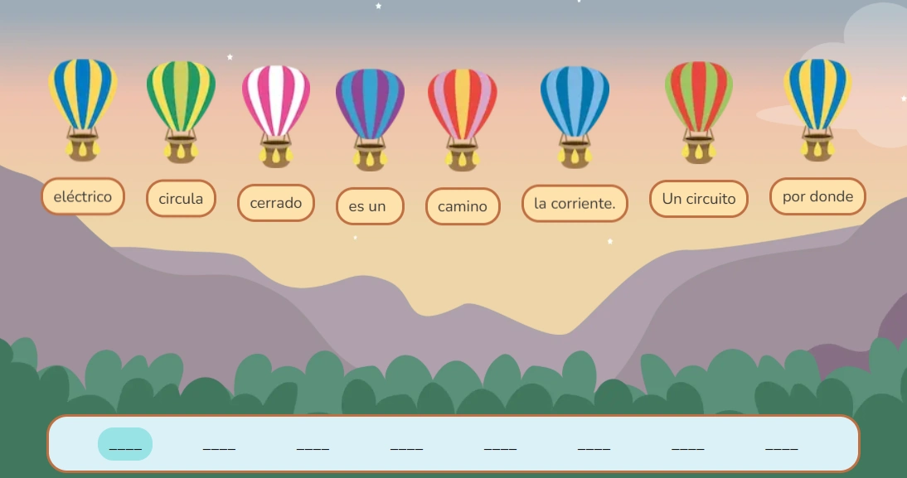

`GameBalloons` es el componente que orquesta la actividad interactiva de ordenar palabras utilizando globos. El jugador debe seleccionar los globos en el orden correcto para formar la frase esperada. El componente gestiona la validación, el estado de los globos y las respuestas. Se divide en los subcomponentes `GameBalloons.Level` para configurar cada nivel o ronda y `GameBalloons.Button` para las acciones.

## Vista previa



## Cómo implementar en un OVA

### 1. Importa los componentes

En tu archivo `.tsx` del OVA, importa todo lo necesario para montar el componente y su gamificación:

```tsx
import { useState } from 'react';
import { Row } from 'books-ui';
import { GameBalloons } from '@games/game-balloons';
import { useGamification } from '@features/gamification';
import { ToastFeedback } from '@features/toast-feedback';
import { Content } from '@layouts';
import { Button } from '@ui';
```

---

### 2. Define las constantes

Declara los identificadores de los modales para las notificaciones de éxito o error:

```tsx
const MODALS = {
  SUCCESS: 'modal-correct-activity',
  WRONG: 'modal-wrong-activity'
};
```

---

### 3. Configura los hooks

Dentro del componente, inicializa los estados necesarios y el hook de gamificación:

```tsx
const [isOpen, setIsOpen] = useState<string | null>(null);

const { Modal, notifyReset, reportResult } = useGamification({
  id: 'ova-08-balloons-1', // ID único por OVA
  total: 1 // Total de preguntas a responder
});
```

---

### 4. Crea el handler de validación

Esta función procesa el resultado de `GameBalloons` y abre el _Feedback_ correspondiente, además de guardar la puntuación usando `reportResult`:

```tsx
const handleValidate = ({ result, options }: { result: boolean, options: any[] }) => {
  const activityResult = result ? 'SUCCESS' : 'WRONG';
  setIsOpen(MODALS[activityResult as keyof typeof MODALS]);

  reportResult({
    success: result,
    correct: result ? 1 : 0,
    total: 1
  });
};

const closeModal = () => setIsOpen(null);
```

---

### 5. Construye la actividad

Estructura tu vista utilizando `<GameBalloons>`, declarando las opciones de la pregunta a través del nivel y definiendo los botones de comprobación:

```tsx
<GameBalloons onResult={handleValidate}>

  {/* Definición del nivel: las palabras desordenadas y la frase correcta esperada */}
  <GameBalloons.Level
    words={['ladra', 'El', 'perro']}
    sentence="El perro ladra"
  />

  {/* Botones de acción */}
  <Row justifyContent="center" alignItems="center" addClass="u-gap-x-6 u-mt-5">
    {/* Botón de validación (por defecto) */}
    <GameBalloons.Button>
      <Button label="Comprobar" variant="check" />
    </GameBalloons.Button>

    {/* Botón de reintento */}
    <GameBalloons.Button type="reset">
      <Button label="Reintentar" variant="reset" onClick={notifyReset} />
    </GameBalloons.Button>
  </Row>

</GameBalloons>
```

---

### 6. Agrega los modales de feedback

Agrega el modal principal de gamificación y los respectivos `ToastFeedback`:

```tsx
{/* Modal de gamificación (éxito final del OVA/Actividad) */}
<Modal audio="assets/audios/content/aud_bien.mp3" />

{/* Feedback de error */}
<ToastFeedback
  type="wrong"
  isOpen={isOpen === MODALS.WRONG}
  onClose={closeModal}
  audio="assets/audios/content/aud_incorrecto.mp3">
  <p>La frase no es correcta. Ordena los globos e inténtalo de nuevo.</p>
</ToastFeedback>

{/* Feedback de acierto */}
<ToastFeedback
  type="success"
  isOpen={isOpen === MODALS.SUCCESS}
  onClose={closeModal}
  audio="assets/audios/content/aud_correcto.mp3">
  <p>¡Buen trabajo! Has formado la frase correctamente.</p>
</ToastFeedback>
```

---

## Props de GameBalloons

El componente envolvente principal que maneja el estado.

| Prop | Tipo | Req. | Descripción |
|---|---|---|---|
| `onResult` | `({ result, options }) => void` | | Función callback llamada tras validar la respuesta. Recibe un booleano `result` indicando si la respuesta fue correcta y el detalle `options`. |

## Props de GameBalloons.Level

Componente que define la oración u ordenamiento requerido en la vista.

| Prop | Tipo | Req. | Descripción |
|---|---|---|---|
| `words` | `string[]` | ✓ | Array con las palabras o fragmentos (mostrados en desorden). Por cada elemento se generará un globo en pantalla. |
| `sentence` | `string` | ✓ | La frase correcta esperada. Este campo es contra el que se valida la respuesta del usuario (ignorando mayúsculas, espacios y signos de puntuación). |

## Props de GameBalloons.Button

Wrapper controlador de los botones de interacción interna.

| Prop | Tipo | Req. | Descripción |
|---|---|---|---|
| `type` | `"reset"` \| `"next"` \| `undefined` | | Omítelo para que el botón valide la respuesta. Usa `"reset"` para reiniciarla, o `"next"` para la navegación después de acertar. |
| `children` | `ReactElement` | ✓ | Componente clickeable (como `<Button>`) al que se inyectarán las interacciones y estados `disabled`. |
