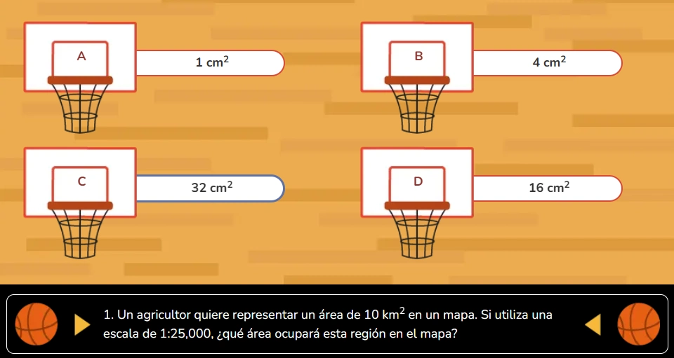

`GameBasketball` es el componente raíz para crear preguntas de selección múltiple ambientadas en una cancha de baloncesto. El estudiante elige la respuesta correcta y lanza el balón a la canasta. Gestiona el estado de selección, validación y resultado con un retardo configurable. Se compone de tres subcomponentes: `GameBasketball.Provider`, `GameBasketball.Radio` y `GameBasketball.Button`.

## Vista previa



## Cómo implementar en un OVA

### 1. Importa los componentes

```tsx
import { useState } from 'react';
import { GameBasketball } from '@games/game-basketball';
import { useGamification } from '@features/gamification';
import { ToastFeedback } from '@features/toast-feedback';
import { Button } from '@ui';
```

---

### 2. Define las constantes

```tsx
const MODALS = {
  SUCCESS: 'modal-correct-activity',
  WRONG: 'modal-wrong-activity'
};

const LENGTH_QUESTION = 1; // total de preguntas
```

---

### 3. Configura los hooks

```tsx
const [isOpen, setIsOpen] = useState<string | null>(null);

const { Modal, Stars, notifyReset, reportResult } = useGamification({
  id: 'ova-01-activity-1', // debe ser único por actividad
  total: LENGTH_QUESTION
});
```

:::tip[El `id` de gamificación debe ser único por actividad]
Usa el patrón `ova-[número]-activity-[número]` para mantener consistencia y evitar conflictos en el sistema de puntuación.
:::

---

### 4. Crea el handler de validación

```tsx
const handleValidate = ({ result }: { result: boolean }) => {
  const activityResult = result ? 'SUCCESS' : 'WRONG';
  setIsOpen(MODALS[activityResult as keyof typeof MODALS]);

  reportResult({
    success: result,
    correct: LENGTH_QUESTION,
    total: LENGTH_QUESTION
  });
};

const closeModal = () => setIsOpen(null);
```

---

### 5. Construye la actividad

La actividad tiene tres partes dentro de `<GameBasketball>`.

**5a. El proveedor con su pregunta** — `GameBasketball.Provider` recibe el texto de la pregunta en `question` y envuelve las opciones:

```tsx
<GameBasketball.Provider question="1. Un mapa tiene una escala de 1:50,000. Si la distancia real es de 5 km, ¿cuál sería la distancia en el mapa?">
  {/* opciones van aquí */}
</GameBasketball.Provider>
```

:::caution[Diferencia con otros juegos]
El contenedor de la pregunta en este componente se llama `GameBasketball.Provider`, no `Level`, `Card` ni `Galaxy`. Esto es importante al escribir el código.
:::

**5b. Las opciones** — cada `GameBasketball.Radio` es una opción seleccionable. Van dentro de `Provider`:

```tsx
<GameBasketball.Provider question="1. Un mapa tiene una escala de 1:50,000...">
  <GameBasketball.Radio id="option-1-1" name="option-1" state="wrong"   label="a. 10 cm" />
  <GameBasketball.Radio id="option-1-2" name="option-1" state="wrong"   label="b. 5 cm" />
  <GameBasketball.Radio id="option-1-3" name="option-1" state="success" label="c. 1 cm" />
  <GameBasketball.Radio id="option-1-4" name="option-1" state="wrong"   label="d. 0,5 cm" />
</GameBasketball.Provider>
```

> `state="success"` marca la opción correcta. `state="wrong"` las incorrectas. El `name` debe ser igual en todas las opciones del mismo `Provider`. El `id` debe ser único en toda la página.

**5c. Los botones de acción** — van fuera del `Provider` pero dentro de `<GameBasketball>`:

```tsx
<Row justifyContent="center" alignItems="center" addClass="u-gap-4">
  <GameBasketball.Button>
    <Button label="COMPROBAR" variant="check" />
  </GameBasketball.Button>
  <GameBasketball.Button type="reset">
    <Button label="REINICIAR" onClick={notifyReset} variant="reset" />
  </GameBasketball.Button>
</Row>
```

**5d. Todo junto:**

```tsx
<GameBasketball onResult={handleValidate}>

  {/* 5a y 5b — proveedor con sus opciones */}
  <GameBasketball.Provider question="1. Un mapa tiene una escala de 1:50,000. Si la distancia real entre dos puntos es de 5 km, ¿cuál sería la distancia en el mapa?">
    <GameBasketball.Radio id="option-1-1" name="option-1" state="wrong"   label="a. 10 cm" />
    <GameBasketball.Radio id="option-1-2" name="option-1" state="wrong"   label="b. 5 cm" />
    <GameBasketball.Radio id="option-1-3" name="option-1" state="success" label="c. 1 cm" />
    <GameBasketball.Radio id="option-1-4" name="option-1" state="wrong"   label="d. 0,5 cm" />
  </GameBasketball.Provider>

  {/* 5c — botones */}
  <Row justifyContent="center" alignItems="center" addClass="u-gap-4">
    <GameBasketball.Button>
      <Button label="COMPROBAR" variant="check" />
    </GameBasketball.Button>
    <GameBasketball.Button type="reset">
      <Button label="REINICIAR" onClick={notifyReset} variant="reset" />
    </GameBasketball.Button>
  </Row>

</GameBasketball>
```

---

### 6. Agrega los modales de feedback

```tsx
<Modal
  audio="assets/audios/content/aud_gr1_ova-01_sld-1 (Bien).mp3"
  interpreter={{ contentURL: 'content/vid_int_ova-01_sld-1 (Bien).mp4' }}
/>

<ToastFeedback
  type="wrong"
  isOpen={isOpen === MODALS.WRONG}
  onClose={closeModal}
  interpreter={{ contentURL: 'content/vid_int_ova-01_sld-1 (Incorrecto).mp4' }}
  audio="assets/audios/content/aud_gr1_ova-01_sld-1 (Incorrecto).mp3">
  <p>Revisa el contenido e intenta de nuevo.</p>
</ToastFeedback>

<ToastFeedback
  type="success"
  isOpen={isOpen === MODALS.SUCCESS}
  onClose={closeModal}
  interpreter={{ contentURL: 'content/vid_int_ova-01_sld-1 (Correcto).mp4' }}
  audio="assets/audios/content/aud_gr1_ova-01_sld-1 (Correcto).mp3">
  <p>¡Muy bien! Has respondido correctamente.</p>
</ToastFeedback>
```

---

## Subcomponentes

### `GameBasketball`

Contenedor raíz. Gestiona el estado global de selección y validación con retardo configurable.

| Prop | Tipo | Req. | Descripción |
|---|---|---|---|
| `onResult` | `({ result, options }) => void` | | Callback al comprobar. Recibe `result` (boolean) y el array de opciones seleccionadas |
| `resultDelayMs` | `number` | | Retardo en ms antes de ejecutar `onResult` tras comprobar. Por defecto `900` |

:::tip[Usa `resultDelayMs` para sincronizar con la animación del balón]
El retardo de 900ms por defecto está pensado para que la animación del lanzamiento del balón termine antes de abrir el modal. Ajústalo si la animación tarda más o menos.

```tsx
<GameBasketball onResult={handleValidate} resultDelayMs={1200}>
```
:::

---

### `GameBasketball.Provider`

Contenedor de la pregunta y sus opciones.

| Prop | Tipo | Req. | Descripción |
|---|---|---|---|
| `question` | `string` | ✓ | Texto de la pregunta |

---

### `GameBasketball.Radio`

Cada opción de respuesta dentro de un `Provider`.

| Prop | Tipo | Req. | Descripción |
|---|---|---|---|
| `id` | `string` | ✓ | Identificador único en toda la página |
| `name` | `string` | ✓ | Agrupa las opciones del mismo `Provider`. Igual en todos los radios del mismo bloque |
| `label` | `string` | ✓ | Texto visible de la opción |
| `state` | `"success" \| "wrong"` | ✓ | Define si la opción es correcta o incorrecta |

> Debe haber exactamente un `state="success"` por `Provider`.

---

### `GameBasketball.Button`

Botón de acción. Siempre debe ir dentro de `<GameBasketball>`, fuera del `Provider`.

| Prop | Tipo | Req. | Descripción |
|---|---|---|---|
| `type` | `"reset"` | | Sin valor comprueba y dispara `onResult`. Con `"reset"` reinicia la selección |