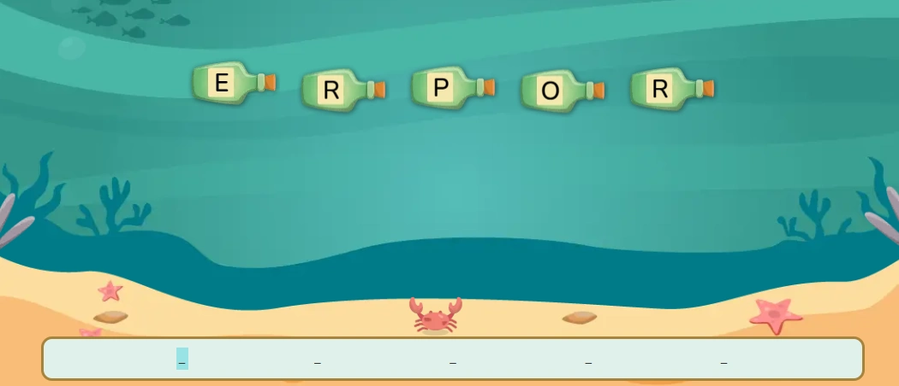

`GameBottle` es el componente raíz para crear actividades donde el estudiante arma una palabra seleccionando letras que aparecen en botellas animadas. Gestiona el estado de selección, validación y resultado. Se compone de cinco subcomponentes: `GameBottle.Letters`, `GameBottle.Word`, `GameBottle.Actions`, `GameBottle.Description` y el raíz `GameBottle`.

:::caution[Diseñado para adivinar palabras]
`GameBottle` es exclusivo para actividades donde el estudiante forma una palabra letra por letra. No es un juego de selección múltiple — la respuesta correcta siempre es la palabra completa definida en `word`.
:::

## Vista previa



## Cómo implementar en un OVA

### 1. Importa los componentes

```tsx
import { useState } from 'react';
import { useGamification } from '@features/gamification';
import { ToastFeedback } from '@features/toast-feedback';
import { GameBottle } from '@games/game-bottles';
import { Content } from '@layouts';
import { Button } from '@ui';
import { Audio, Col, Row } from 'books-ui';
```

---

### 2. Define las constantes

```tsx
const MODALS = {
  SUCCESS: 'modal-correct-activity',
  WRONG: 'modal-wrong-activity'
};

const LENGTH_QUESTION = 1; // total de palabras
```

---

### 3. Configura los hooks

```tsx
const [isOpen, setIsOpen] = useState<string | null>(null);

const { Modal, Stars, notifyReset, reportResult } = useGamification({
  id: 'ova-01-activity-1', // debe ser único por actividad
  total: LENGTH_QUESTION
});
```

:::tip[El `id` de gamificación debe ser único por actividad]
Usa el patrón `ova-[número]-activity-[número]` para mantener consistencia y evitar conflictos en el sistema de puntuación.
:::

---

### 4. Crea el handler de validación

```tsx
const handleValidate = (result: boolean) => {
  const activityResult = result ? 'SUCCESS' : 'WRONG';
  setIsOpen(MODALS[activityResult as keyof typeof MODALS]);

  reportResult({
    success: result,
    correct: LENGTH_QUESTION,
    total: LENGTH_QUESTION
  });
};

const closeModal = () => setIsOpen(null);
```

:::caution[La firma de `onResult` es diferente a otros juegos]
A diferencia de `GameMoney`, `GameSpace` o `GameBasketball` donde `onResult` recibe `{ result, options }`, aquí recibe directamente el booleano:

```tsx
// ✅ Correcto — recibe boolean directo
const handleValidate = (result: boolean) => { ... };
<GameBottle onResult={handleValidate}>

// ❌ Incorrecto — destructuring no funciona aquí
const handleValidate = ({ result }: { result: boolean }) => { ... };

// ❌ Incorrecto — se ejecuta al renderizar
<GameBottle onResult={() => handleValidate}>
```
:::

---

### 5. Construye la actividad

La actividad se arma en cinco partes dentro de `<GameBottle>`.

**5a. Las letras** — `GameBottle.Letters` genera las botellas animadas a partir de la palabra. Recibe la palabra completa en `word` en mayúsculas:

```tsx
<GameBottle.Letters word="ECOSISTEMA" />
```

> Las letras de la palabra se distribuyen en botellas animadas de forma aleatoria para que el estudiante las identifique y seleccione en orden.

**5b. Los espacios de la palabra** — `GameBottle.Word` muestra los espacios vacíos donde el estudiante va armando la palabra seleccionando letras:

```tsx
<GameBottle.Word />
```

> No recibe props. Se sincroniza automáticamente con el estado interno del juego.

**5c. Los botones de acción** — `GameBottle.Actions` envuelve cada botón por separado. El botón de reset usa `type="reset"`:

```tsx
<GameBottle.Actions>
  <Button label="COMPROBAR" variant="check" />
</GameBottle.Actions>

<GameBottle.Actions type="reset">
  <Button label="REINICIAR" onClick={notifyReset} variant="reset" />
</GameBottle.Actions>
```

:::caution[Un botón por `Actions`]
A diferencia de otros juegos donde los botones van juntos en un `Row`, aquí cada `GameBottle.Actions` envuelve **un solo botón**. No pongas ambos botones dentro del mismo `Actions`.
:::

**5d. La descripción** — `GameBottle.Description` es opcional. Úsala para agregar el pie de figura de la animación:

```tsx
<GameBottle.Description>
  <p><strong>Figura 1.</strong>&nbsp;Juego de botellas.</p>
</GameBottle.Description>
```

**5e. Todo junto:**

```tsx
<GameBottle onResult={handleValidate}>

  {/* 5a — botellas con letras */}
  <GameBottle.Letters word="ECOSISTEMA" />

  {/* 5b — espacios de la palabra */}
  <GameBottle.Word />

  {/* 5c — botones */}
  <GameBottle.Actions>
    <Button label="COMPROBAR" variant="check" />
  </GameBottle.Actions>
  <GameBottle.Actions type="reset">
    <Button label="REINICIAR" onClick={notifyReset} variant="reset" />
  </GameBottle.Actions>

  {/* 5d — descripción opcional */}
  <GameBottle.Description>
    <p><strong>Figura 1.</strong>&nbsp;Juego de botellas.</p>
  </GameBottle.Description>

</GameBottle>
```

---

### 6. Agrega los modales de feedback

```tsx
<Modal
  audio="assets/audios/content/aud_gr1_ova-01_sld-1 (Bien).mp3"
  interpreter={{ contentURL: 'content/vid_int_ova-01_sld-1 (Bien).mp4' }}
/>

<ToastFeedback
  type="wrong"
  isOpen={isOpen === MODALS.WRONG}
  onClose={closeModal}
  interpreter={{ contentURL: 'content/vid_int_ova-01_sld-1 (Incorrecto).mp4' }}
  audio="assets/audios/content/aud_gr1_ova-01_sld-1 (Incorrecto).mp3">
  <p>Revisa las letras e intenta de nuevo.</p>
</ToastFeedback>

<ToastFeedback
  type="success"
  isOpen={isOpen === MODALS.SUCCESS}
  onClose={closeModal}
  interpreter={{ contentURL: 'content/vid_int_ova-01_sld-1 (Correcto).mp4' }}
  audio="assets/audios/content/aud_gr1_ova-01_sld-1 (Correcto).mp3">
  <p>¡Muy bien! Formaste la palabra correctamente.</p>
</ToastFeedback>
```

---

## Subcomponentes

### `GameBottle`

Contenedor raíz. Gestiona el estado de selección de letras, validación y resultado.

| Prop | Tipo | Req. | Descripción |
|---|---|---|---|
| `onResult` | `(result: boolean) => void` | | Callback al comprobar. Recibe directamente el booleano del resultado — sin destructuring |

---

### `GameBottle.Letters`

Genera las botellas animadas con las letras de la palabra. Siempre va primero dentro de `<GameBottle>`.

| Prop | Tipo | Req. | Descripción |
|---|---|---|---|
| `word` | `string` | ✓ | Palabra completa a adivinar. Se recomienda en mayúsculas (ej: `"ECOSISTEMA"`) |

---

### `GameBottle.Word`

Muestra los espacios vacíos donde el estudiante arma la palabra. No recibe props — se sincroniza automáticamente con el contexto del juego.

---

### `GameBottle.Actions`

Envuelve un botón de acción. Cada botón va en su propio `Actions`.

| Prop | Tipo | Req. | Descripción |
|---|---|---|---|
| `type` | `"reset"` | | Sin valor actúa como Comprobar. Con `"reset"` limpia las letras seleccionadas |

---

### `GameBottle.Description`

Contenedor opcional para el pie de figura o descripción de la animación. Acepta cualquier JSX como contenido.