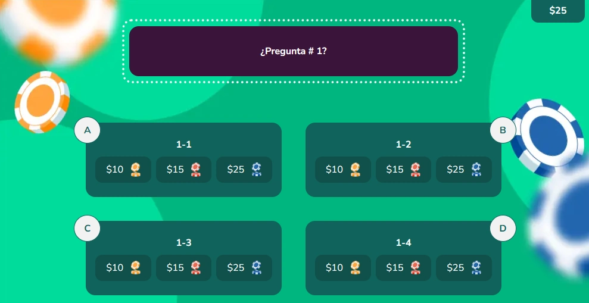

`GameCasino` es el componente raíz para crear actividades de selección múltiple ambientadas en un casino educativo. El estudiante elige una opción y realiza una apuesta — si acierta, gana fichas. Gestiona el estado de selección y resultado. Se compone de cuatro subcomponentes: `GameCasino.Init`, `GameCasino.Level`, `GameCasino.Element` y `GameCasino.Button`.

:::caution[El handler de validación es diferente a otros juegos]
`GameCasino` no usa `{ result }` en su callback — recibe `{ options }` con el array de opciones seleccionadas. El resultado se determina comparando el `id` de la opción elegida.

```tsx
// ✅ Correcto — un solo modal success y uno wrong
const MODALS = {
  SUCCESS: 'modal-correct-activity',
  WRONG: 'modal-wrong-activity'
};

const handleValidate = ({ options }: { options: { id: string; state: string }[] }) => {
  if (!options.length) return;
  const correct = options[0].state === 'success';
  setIsOpen(correct ? MODALS.SUCCESS : MODALS.WRONG);

  reportResult({
    success: correct,
    correct: LENGTH_QUESTION,
    total: LENGTH_QUESTION
  });
};

// ❌ Incorrecto
const handleValidate = ({ result }: { result: boolean }) => { ... };
```
:::

:::note[Puedes usar un toast por opción o uno global por resultado]
`GameCasino` soporta dos patrones para los toasts. Elige el que mejor se adapte a tu OVA:

- **Un toast por resultado** (recomendado): un `ToastFeedback` de éxito y uno de error. Más simple y consistente con los otros juegos.
- **Un toast por opción**: un `ToastFeedback` por cada `GameCasino.Element`. Útil cuando necesitas retroalimentación específica por cada opción incorrecta.

Esta documentación cubre el patrón recomendado de un toast por resultado.
:::

## Vista previa



## Cómo implementar en un OVA

### 1. Importa los componentes

```tsx
import { useState } from 'react';
import { GameCasino } from '@/shared/components/games/game-casino';
import { useGamification } from '@features/gamification';
import { ToastFeedback } from '@features/toast-feedback';
import { SectionNavigation } from '@/shared/utils/section-navigation';
import { Button } from '@ui';
```

---

### 2. Define las constantes

```tsx
const MODALS = {
  SUCCESS: 'modal-correct-activity',
  WRONG: 'modal-wrong-activity'
};

const LENGTH_QUESTION = 1; // total de preguntas
```

---

### 3. Configura los hooks

```tsx
const [isOpen, setIsOpen] = useState<string | null>(null);

const { Modal, Stars, notifyReset, reportResult } = useGamification({
  id: 'ova-01-activity-1', // debe ser único por actividad
  total: LENGTH_QUESTION
});
```

:::tip[El `id` de gamificación debe ser único por actividad]
Usa el patrón `ova-[número]-activity-[número]` para mantener consistencia y evitar conflictos en el sistema de puntuación.
:::

---

### 4. Crea el handler de validación

```tsx
const handleValidate = ({ options }: { options: { id: string; state: string }[] }) => {
  if (!options.length) return;

  const correct = options[0].state === 'success';
  setIsOpen(correct ? MODALS.SUCCESS : MODALS.WRONG);

  reportResult({
    success: correct,
    correct: LENGTH_QUESTION,
    total: LENGTH_QUESTION
  });
};

const closeModal = () => setIsOpen(null);
```

> `options[0].state` ya trae el valor `"success"` o `"wrong"` del `GameCasino.Element` seleccionado — no necesitas comparar ids manualmente.

---

### 5. Construye la actividad

La actividad tiene cuatro partes. A diferencia de otros juegos, `GameCasino` envuelve el `Panel` completo — incluyendo todas las secciones.

**5a. El wrapper global** — `<GameCasino>` envuelve el `Panel` y todas sus secciones:

```tsx
<Panel stars={Stars}>
  <GameCasino onResult={handleValidate}>
    {/* secciones aquí */}
  </GameCasino>
</Panel>
```

:::caution[GameCasino envuelve el Panel internamente]
A diferencia de `RaceCard` donde el wrapper va por fuera del `Panel`, en `GameCasino` el orden es inverso: `Panel` va por fuera y `GameCasino` adentro.
:::

**5b. Pantalla de introducción** — `GameCasino.Init` va en la primera sección del `Panel`. Muestra la animación inicial y las instrucciones:

```tsx
<Panel.Section>
  <GameCasino.Init textInit="Responde correctamente las preguntas y gana fichas." />
</Panel.Section>
```

**5c. La pregunta con sus opciones** — `GameCasino.Level` recibe el texto de la pregunta en `label`. Cada opción es un `GameCasino.Element` con un `bullet` visible (A, B, C, D):

```tsx
<GameCasino.Level label="¿Pregunta #1?">
  <GameCasino.Element bullet="A" id="Q1_A1" name="q1" label="Opción incorrecta 1" state="wrong" />
  <GameCasino.Element bullet="B" id="Q1_A2" name="q1" label="Opción correcta"     state="success" />
  <GameCasino.Element bullet="C" id="Q1_A3" name="q1" label="Opción incorrecta 2" state="wrong" />
  <GameCasino.Element bullet="D" id="Q1_A4" name="q1" label="Opción incorrecta 3" state="wrong" />
</GameCasino.Level>
```

> El `id` de cada `Element` debe ser único en toda la página y es el valor que usas en `handleValidate` para identificar qué opción eligió el estudiante y qué toast abrir.

**5d. Los botones de acción** — van dentro de la misma sección, fuera del `Level`:

```tsx
<Row justifyContent="center" addClass="u-gap-4 u-mt-4">
  <GameCasino.Button>
    <Button label="COMPROBAR" variant="check" />
  </GameCasino.Button>
  <GameCasino.Button type="reset">
    <Button label="REINICIAR" variant="reset" onClick={notifyReset} />
  </GameCasino.Button>
</Row>
```

**5e. Todo junto:**

```tsx
<Panel stars={Stars}>
  <GameCasino onResult={handleValidate}>

    {/* 5b — introducción */}
    <Panel.Section>
      <Row justifyContent="center" alignItems="center">
        <Col xs="11" mm="10" md="9" lg="8" hd="7" addClass="u-flow">
          <GameCasino.Init textInit="Responde correctamente las preguntas y gana fichas." />
        </Col>
      </Row>
    </Panel.Section>

    {/* 5c y 5d — pregunta con opciones y botones */}
    <Panel.Section>
      <Row justifyContent="center" alignItems="center">
        <Col xs="11" mm="10" md="9" lg="8" hd="7" addClass="u-flow">
          <GameCasino.Level label="¿Pregunta #1?">
            <GameCasino.Element bullet="A" id="Q1_A1" name="q1" label="Opción incorrecta 1" state="wrong" />
            <GameCasino.Element bullet="B" id="Q1_A2" name="q1" label="Opción correcta"     state="success" />
            <GameCasino.Element bullet="C" id="Q1_A3" name="q1" label="Opción incorrecta 2" state="wrong" />
            <GameCasino.Element bullet="D" id="Q1_A4" name="q1" label="Opción incorrecta 3" state="wrong" />
          </GameCasino.Level>
          <Row justifyContent="center" addClass="u-gap-4 u-mt-4">
            <GameCasino.Button>
              <Button label="COMPROBAR" variant="check" />
            </GameCasino.Button>
            <GameCasino.Button type="reset">
              <Button label="REINICIAR" variant="reset" onClick={notifyReset} />
            </GameCasino.Button>
          </Row>
        </Col>
      </Row>
    </Panel.Section>

  </GameCasino>
</Panel>
```

---

### 6. Agrega los modales de feedback

`GameCasino` soporta dos patrones para los toasts. Elige el que mejor se adapte a tu OVA.

---

**Patrón A — Un toast por resultado** (recomendado)

Solo dos `ToastFeedback`: uno de éxito y uno de error. Más simple y consistente con los otros juegos.

Ajusta el handler para usar `state`:

```tsx
const handleValidate = ({ options }: { options: { id: string; state: string }[] }) => {
  if (!options.length) return;
  const correct = options[0].state === 'success';
  setIsOpen(correct ? MODALS.SUCCESS : MODALS.WRONG);
  reportResult({ success: correct, correct: LENGTH_QUESTION, total: LENGTH_QUESTION });
};
```

```tsx
<ToastFeedback
  type="success"
  isOpen={isOpen === MODALS.SUCCESS}
  onClose={() => { closeModal(); SectionNavigation.next(); }}
  audio="assets/audios/correct.mp3">
  <p>¡Correcto! Ganaste la apuesta.</p>
</ToastFeedback>

<ToastFeedback
  type="wrong"
  isOpen={isOpen === MODALS.WRONG}
  onClose={closeModal}
  audio="assets/audios/wrong.mp3">
  <p>Incorrecto. Perdiste tus fichas. Inténtalo de nuevo.</p>
</ToastFeedback>
```

---

**Patrón B — Un toast por opción**

Un `ToastFeedback` por cada `GameCasino.Element`. Útil cuando necesitas retroalimentación específica para cada opción incorrecta.

Ajusta el handler para guardar el `id` de la opción:

```tsx
const handleValidate = ({ options }: { options: { id: string }[] }) => {
  if (!options.length) return;
  setIsOpen(options[0].id);
  const result = options[0].id === 'Q1_A2'; // id del Element con state="success"
  reportResult({ success: result, correct: LENGTH_QUESTION, total: LENGTH_QUESTION });
};
```

```tsx
{/* Opción A — incorrecta */}
<ToastFeedback type="wrong" isOpen={isOpen === 'Q1_A1'} onClose={closeModal}
  audio="assets/audios/wrong.mp3">
  <p>Incorrecto. La opción A no es válida. Perdiste tus fichas.</p>
</ToastFeedback>

{/* Opción B — correcta */}
<ToastFeedback type="success" isOpen={isOpen === 'Q1_A2'}
  onClose={() => { closeModal(); SectionNavigation.next(); }}
  audio="assets/audios/correct.mp3">
  <p>¡Correcto! Ganaste la apuesta con la opción B.</p>
</ToastFeedback>

{/* Opción C — incorrecta */}
<ToastFeedback type="wrong" isOpen={isOpen === 'Q1_A3'} onClose={closeModal}
  audio="assets/audios/wrong.mp3">
  <p>Incorrecto. La opción C no es correcta. Perdiste tus fichas.</p>
</ToastFeedback>

{/* Opción D — incorrecta */}
<ToastFeedback type="wrong" isOpen={isOpen === 'Q1_A4'} onClose={closeModal}
  audio="assets/audios/wrong.mp3">
  <p>Incorrecto. La opción D no es la respuesta. Perdiste tus fichas.</p>
</ToastFeedback>
```

:::tip[Usa `SectionNavigation.next()` en el toast correcto]
En ambos patrones, el toast de éxito debe avanzar a la siguiente sección al cerrarse:

```tsx
onClose={() => {
  closeModal();
  SectionNavigation.next();
}}
```
:::

---

## Subcomponentes

### `GameCasino`

Contenedor raíz. Envuelve todas las secciones del juego dentro del `Panel`.

| Prop | Tipo | Req. | Descripción |
|---|---|---|---|
| `onResult` | `(data: { options: { id: string }[] }) => void` | | Callback al comprobar. Recibe el array de opciones seleccionadas — no un booleano |

---

### `GameCasino.Init`

Pantalla de introducción con animación de casino. Va en la primera sección del `Panel`.

| Prop | Tipo | Req. | Descripción |
|---|---|---|---|
| `textInit` | `string` | | Texto de instrucciones visible en la pantalla de inicio |
| `className` | `string` | | Clases CSS adicionales para el contenedor |

---

### `GameCasino.Level`

Contenedor de la pregunta y sus opciones. Soporta imagen de fondo personalizada.

| Prop | Tipo | Req. | Descripción |
|---|---|---|---|
| `label` | `string` | ✓ | Texto de la pregunta |
| `background` | `string` | | Ruta de imagen de fondo personalizada. Si se omite usa el fondo por defecto |

---

### `GameCasino.Element`

Cada opción de respuesta. Muestra un bullet visible (A, B, C, D) junto al texto.

| Prop | Tipo | Req. | Descripción |
|---|---|---|---|
| `id` | `string` | ✓ | Identificador único. Se usa en `handleValidate` y en `isOpen` para abrir el toast correspondiente |
| `name` | `string` | ✓ | Agrupa las opciones de la misma pregunta. Igual en todos los elementos del mismo `Level` |
| `label` | `string` | ✓ | Texto visible de la opción |
| `state` | `"success" \| "wrong"` | ✓ | Define si la opción es correcta o incorrecta |
| `bullet` | `string` | ✓ | Letra visible junto a la opción (ej: `"A"`, `"B"`, `"C"`, `"D"`) |

---

### `GameCasino.Button`

Botón de acción. Siempre debe ir dentro de `<GameCasino>`, fuera del `Level`.

| Prop | Tipo | Req. | Descripción |
|---|---|---|---|
| `type` | `"reset"` | | Sin valor comprueba y dispara `onResult`. Con `"reset"` reinicia la selección |