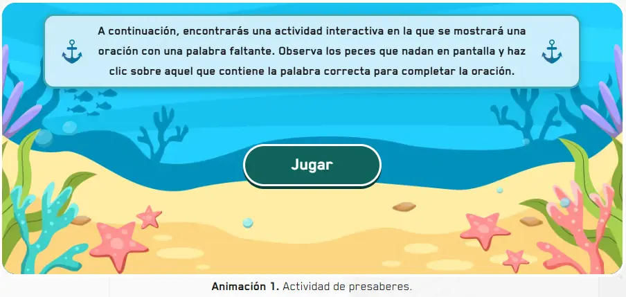
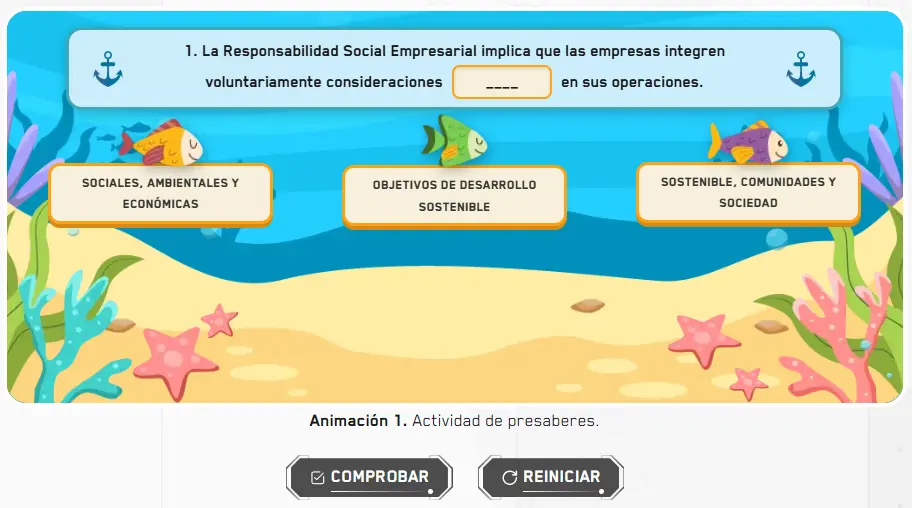

`GameFish` es el componente raíz para crear actividades donde peces animados nadan en pantalla y el estudiante hace clic en el que contiene la palabra correcta para completar una oración. Gestiona el estado de selección, validación y resultado. Se compone de cuatro subcomponentes: `GameFish.Init`, `GameFish.Level`, `GameFish.Fish` y `GameFish.Button`.

### Vista previa del componente de instrucciones


### Vista previa del juego



## Cómo implementar en un OVA

### 1. Importa los componentes

```tsx
import { useState } from 'react';
import { GameFish } from '@games/game-fish';
import { useGamification } from '@features/gamification';
import { ToastFeedback } from '@features/toast-feedback';
import { Button } from '@ui';
```

---

### 2. Define las constantes

```tsx
const MODALS = {
  TRUE: 'modal-correct-activity',
  FALSE: 'modal-wrong-activity'
};

const LENGTH_QUESTION = 5; // total de preguntas
```

---

### 3. Configura los hooks

```tsx
const [isOpen, setIsOpen] = useState<string | null>(null);

const { Modal, Stars, notifyReset, reportResult } = useGamification({
  id: 'ova-01-activity-1',
  total: 5
});
```

:::tip[El `id` de gamificación debe ser único por actividad]
Cada actividad del proyecto debe tener un `id` diferente. Usa el patrón `ova-[número]-activity-[número]` para mantener consistencia.
:::

---

### 4. Crea el handler de validación

```tsx
const handleValidate = ({ result }: { result: boolean }) => {
  const activityResult = result.toString().toUpperCase();
  setIsOpen(MODALS[activityResult as keyof typeof MODALS]);

  reportResult({
    success: result,
    correct: LENGTH_QUESTION,
    total: LENGTH_QUESTION
  });
};

const closeModal = () => setIsOpen(null);
```

> Al igual que en `Selects`, usa `result.toString().toUpperCase()` para convertir el booleano a `"TRUE"` o `"FALSE"` y coincidir con las keys de `MODALS`.

---

### 5. Construye la actividad

La actividad se arma en tres partes.

**5a. Pantalla de instrucciones** — usa `GameFish.Init` en una sección separada antes de la actividad para explicarle al estudiante cómo funciona el juego:

```tsx
<GameFish.Init labelInstruction="A continuación, encontrarás una actividad interactiva en la que se mostrará una oración con una palabra faltante. Observa los peces que nadan en pantalla y haz clic sobre aquel que contiene la palabra correcta para completar la oración." />
```

> `GameFish.Init` solo muestra las instrucciones. No necesita estar dentro de `<GameFish>`.

**5b. El nivel con su oración** — `GameFish.Level` recibe la oración incompleta en `label`. Usa `___` para marcar el espacio en blanco:

```tsx
<GameFish.Level label="La RSE implica que las empresas integren voluntariamente consideraciones ___ en sus operaciones.">
  {/* peces van aquí */}
</GameFish.Level>
```

**5c. Los peces** — cada `GameFish.Fish` es un pez animado con una palabra. Van dentro del `Level`:

```tsx
<GameFish.Level label="La RSE implica que las empresas integren voluntariamente consideraciones ___ en sus operaciones.">
  <GameFish.Fish id="1-1" name="option-1" label="sociales, ambientales y económicas" state="success" />
  <GameFish.Fish id="1-2" name="option-1" label="objetivos de desarrollo sostenible"  state="wrong" />
  <GameFish.Fish id="1-3" name="option-1" label="sostenible, comunidades y sociedad"  state="wrong" />
</GameFish.Level>
```

> `state="success"` marca el pez correcto. `state="wrong"` los incorrectos. El `name` debe ser igual en todos los peces del mismo nivel. El `id` debe ser único en toda la página.

**5d. Los botones de acción** — van fuera del `Level` pero dentro de `<GameFish>`:

```tsx
<Row justifyContent="center" alignItems="center" addClass="u-gap-4">
  <GameFish.Button>
    <Button label="COMPROBAR" variant="check" />
  </GameFish.Button>
  <GameFish.Button type="reset">
    <Button label="REINICIAR" onClick={notifyReset} variant="reset" />
  </GameFish.Button>
</Row>
```

**5e. Todo junto** — cada pregunta es un `<GameFish>` independiente. A diferencia de `GameThisOrThat`, aquí cada nivel tiene su propio componente raíz:

```tsx
{/* Pregunta 1 */}
<GameFish onResult={handleValidate}>
  <figure>
    <GameFish.Level label="1. La RSE implica que las empresas integren voluntariamente consideraciones ___ en sus operaciones.">
      <GameFish.Fish id="1-1" name="option-1" label="sociales, ambientales y económicas" state="success" />
      <GameFish.Fish id="1-2" name="option-1" label="objetivos de desarrollo sostenible"  state="wrong" />
      <GameFish.Fish id="1-3" name="option-1" label="sostenible, comunidades y sociedad"  state="wrong" />
    </GameFish.Level>
    <figcaption>
      <p><strong>Animación 1. </strong>Actividad de presaberes.</p>
    </figcaption>
  </figure>

  <Row justifyContent="center" alignItems="center" addClass="u-gap-4">
    <GameFish.Button>
      <Button label="COMPROBAR" variant="check" />
    </GameFish.Button>
    <GameFish.Button type="reset">
      <Button label="REINICIAR" onClick={notifyReset} variant="reset" />
    </GameFish.Button>
  </Row>
</GameFish>

{/* Pregunta 2 */}
<GameFish onResult={handleValidate}>
  <figure>
    <GameFish.Level label="2. El principio de crear valor compartido sugiere beneficios para la ___ .">
      <GameFish.Fish id="2-1" name="option-2" label="comunidad"     state="wrong" />
      <GameFish.Fish id="2-2" name="option-2" label="sostenibilidad" state="wrong" />
      <GameFish.Fish id="2-3" name="option-2" label="sociedad"       state="success" />
    </GameFish.Level>
    <figcaption>
      <p><strong>Animación 2. </strong>Actividad de presaberes.</p>
    </figcaption>
  </figure>

  <Row justifyContent="center" alignItems="center" addClass="u-gap-4">
    <GameFish.Button>
      <Button label="COMPROBAR" variant="check" />
    </GameFish.Button>
    <GameFish.Button type="reset">
      <Button label="REINICIAR" onClick={notifyReset} variant="reset" />
    </GameFish.Button>
  </Row>
</GameFish>
```

---

### 6. Agrega los modales de feedback

```tsx
<Modal
  audio="assets/audios/content/aud_ova-97_sld-4 (Bien).mp3"
  interpreter={{ contentURL: 'content/vid_int_ova-97_sld-4 (Bien).mp4' }}
/>

<ToastFeedback
  type="success"
  isOpen={isOpen === MODALS.TRUE}
  onClose={closeModal}
  label="EXCELENTE"
  interpreter={{ contentURL: 'content/vid_int_ova-97_sld-4 (Correcto).mp4' }}
  audio="assets/audios/content/aud_ova-97_sld-4 (Correcto).mp3">
  <p>Has demostrado un buen dominio de los conceptos. ¡Felicidades!</p>
</ToastFeedback>

<ToastFeedback
  type="wrong"
  isOpen={isOpen === MODALS.FALSE}
  onClose={closeModal}
  interpreter={{ contentURL: 'content/vid_int_ova-97_sld-4 (Incorrecto).mp4' }}
  audio="assets/audios/content/aud_ova-97_sld-4 (Incorrecto).mp3">
  <p>¡Inténtalo de nuevo! Revisa el material del curso para asegurarte de escoger las respuestas correctas.</p>
</ToastFeedback>
```

> `ToastFeedback` acepta un prop `label` para personalizar el título del toast. En el de éxito del ejemplo se usa `label="EXCELENTE"`.

---

## Subcomponentes

### `GameFish`

Contenedor raíz de cada pregunta. Cada pregunta es un `<GameFish>` independiente.

| Prop | Tipo | Req. | Descripción |
|---|---|---|---|
| `onResult` | `({ result: boolean }) => void` | | Callback al comprobar. Recibe `true` si el pez seleccionado tiene `state="success"` |

---

### `GameFish.Init`

Pantalla de instrucciones del juego. Se usa una sola vez, en una sección antes de las preguntas. No va dentro de `<GameFish>`.

| Prop | Tipo | Req. | Descripción |
|---|---|---|---|
| `labelInstruction` | `string` | ✓ | Texto de instrucciones que se muestra al estudiante antes de comenzar |

---

### `GameFish.Level`

Contiene la oración incompleta y los peces. Siempre va dentro de `<GameFish>`.

| Prop | Tipo | Req. | Descripción |
|---|---|---|---|
| `label` | `string` | ✓ | Oración incompleta. Usa `___` para indicar el espacio en blanco |

---

### `GameFish.Fish`

Cada pez animado con una palabra o frase. Van dentro de `GameFish.Level`.

| Prop | Tipo | Req. | Descripción |
|---|---|---|---|
| `id` | `string` | ✓ | Identificador único en toda la página |
| `name` | `string` | ✓ | Agrupa los peces del mismo nivel. Igual en todos los `Fish` del mismo `Level` |
| `label` | `string` | ✓ | Palabra o frase visible en el pez |
| `state` | `"success" \| "wrong"` | ✓ | Define si el pez es la respuesta correcta o incorrecta |

> Debe haber exactamente un `state="success"` por nivel.

---

### `GameFish.Button`

Botón de acción. Siempre debe ir dentro de `<GameFish>`, fuera del `Level`.

| Prop | Tipo | Req. | Descripción |
|---|---|---|---|
| `type` | `"reset"` | | Sin valor comprueba y dispara `onResult`. Con `"reset"` reinicia la selección |