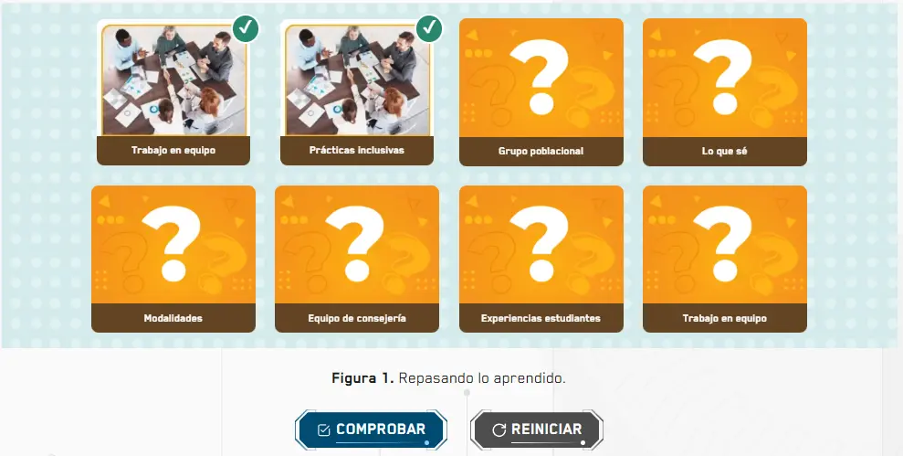

import CoreRepoInfo from '../../../components/CoreRepoInfo.astro';

`MemoryCardActivity` es el componente raíz para crear juegos de memoria donde el estudiante voltea cartas para encontrar las parejas. Gestiona el estado de selección, emparejamiento y resultado. Se compone de cinco subcomponentes: `MemoryCardActivity.Board`, `MemoryCardActivity.Card`, `MemoryCardActivity.CardFront`, `MemoryCardActivity.CardBack` y `MemoryCardActivity.Button`.

## Vista previa



## Cómo funciona el emparejamiento

Antes de implementar, es importante entender cómo se forman las parejas. El `id` de cada `MemoryCardActivity.Card` es lo que las empareja — **dos cartas con el mismo `id` forman una pareja**. Cuando el estudiante voltea dos cartas con el mismo `id`, se consideran encontradas.

```
Card id={1}  ←→  Card id={1}  ✅ pareja correcta
Card id={2}  ←→  Card id={2}  ✅ pareja correcta
Card id={1}  ←→  Card id={2}  ❌ no son pareja
```

Cada pareja tiene exactamente dos cartas con el mismo `id`. Si tienes 4 parejas, usas los ids `1, 1, 2, 2, 3, 3, 4, 4`.

## Cómo implementar en un OVA

### 1. Importa los componentes

```tsx
import { useState } from 'react';
import { MemoryCardActivity } from '@games/game-memory-card';
import { useGamification } from '@features/gamification';
import { ToastFeedback } from '@features/toast-feedback';
import { Button } from '@ui';
```

---

### 2. Define las constantes

```tsx
const MODALS = {
  SUCCESS: 'modal-correct-activity',
  WRONG: 'modal-wrong-activity'
};

const LENGTH_QUESTION = 1;
```

---

### 3. Configura los hooks

```tsx
const [isOpen, setIsOpen] = useState<string | null>(null);

const { Modal, Stars, notifyReset, reportResult } = useGamification({
  id: 'ova-01-activity-1', // debe ser único por actividad
  total: LENGTH_QUESTION
});
```

:::tip[El `id` de gamificación debe ser único por actividad]
Usa el patrón `ova-[número]-activity-[número]` para mantener consistencia y evitar conflictos en el sistema de puntuación.
:::

---

### 4. Crea el handler de validación

```tsx
const onResult = (result: boolean) => {
  const activityResult = result ? 'SUCCESS' : 'WRONG';
  setIsOpen(MODALS[activityResult as keyof typeof MODALS]);

  reportResult({
    success: result,
    correct: result ? 1 : 0,
    total: 1
  });
};

const closeModal = () => setIsOpen(null);
```

:::caution[`onResult` recibe el booleano directamente]
A diferencia de la mayoría de los juegos, `MemoryCardActivity` pasa el resultado como un `boolean` directo — no como un objeto `{ result }`:

```tsx
// ✅ Correcto
const onResult = (result: boolean) => { ... };

// ❌ Incorrecto
const onResult = ({ result }: { result: boolean }) => { ... };
```
:::

---

### 5. Construye la actividad

La actividad se arma en cuatro partes dentro de `<MemoryCardActivity>`.

**5a. El tablero** — `MemoryCardActivity.Board` define el fondo visual del tablero. Va primero dentro del raíz:

```tsx
<MemoryCardActivity.Board background="assets/images/fondo-tablero.webp" />
```

> Si se omite `background`, el tablero usa el fondo por defecto. Es el único subcomponente que no envuelve hijos.

**5b. Las parejas de cartas** — cada `MemoryCardActivity.Card` tiene dos caras: `CardBack` (boca abajo, la que el estudiante ve al inicio) y `CardFront` (boca arriba, la que se revela al voltear). Las dos cartas de la misma pareja comparten el mismo `id`:

```tsx
{/* Primera carta de la pareja 1 */}
<MemoryCardActivity.Card id={1}>
  <MemoryCardActivity.CardBack>
    <div>
      
    </div>
    <div><p>Etiqueta visible boca abajo</p></div>
  </MemoryCardActivity.CardBack>
  <MemoryCardActivity.CardFront>
    <div>
      
    </div>
    <div><p>Etiqueta visible boca arriba</p></div>
  </MemoryCardActivity.CardFront>
</MemoryCardActivity.Card>

{/* Segunda carta de la pareja 1 — mismo id={1} */}
<MemoryCardActivity.Card id={1}>
  <MemoryCardActivity.CardBack>
    <div>
      
    </div>
    <div><p>Otra etiqueta boca abajo</p></div>
  </MemoryCardActivity.CardBack>
  <MemoryCardActivity.CardFront>
    <div>
      
    </div>
    <div><p>Otra etiqueta boca arriba</p></div>
  </MemoryCardActivity.CardFront>
</MemoryCardActivity.Card>
```

> El contenido de `CardBack` y `CardFront` es JSX libre — puedes usar imágenes, textos, íconos o cualquier combinación.

**5c. Los botones de acción** — van al final, fuera de las cartas pero dentro de `<MemoryCardActivity>`:

```tsx
<Row justifyContent="center" alignItems="center" addClass="u-gap-4">
  <MemoryCardActivity.Button>
    <Button label="COMPROBAR" variant="check" />
  </MemoryCardActivity.Button>
  <MemoryCardActivity.Button type="reset">
    <Button label="REINICIAR" onClick={notifyReset} variant="reset" />
  </MemoryCardActivity.Button>
</Row>
```

**5d. Todo junto** — ejemplo con 4 parejas completas:

```tsx
<MemoryCardActivity onResult={onResult}>

  {/* 5a — tablero */}
  <MemoryCardActivity.Board background="assets/images/fondo-tablero.webp" />

  {/* 5b — pareja 1 */}
  <MemoryCardActivity.Card id={1}>
    <MemoryCardActivity.CardBack>
      <div></div>
      <div><p>Trabajo en equipo</p></div>
    </MemoryCardActivity.CardBack>
    <MemoryCardActivity.CardFront>
      <div></div>
      <div><p>Trabajo en equipo</p></div>
    </MemoryCardActivity.CardFront>
  </MemoryCardActivity.Card>

  <MemoryCardActivity.Card id={1}>
    <MemoryCardActivity.CardBack>
      <div></div>
      <div><p>Prácticas inclusivas</p></div>
    </MemoryCardActivity.CardBack>
    <MemoryCardActivity.CardFront>
      <div></div>
      <div><p>Prácticas inclusivas</p></div>
    </MemoryCardActivity.CardFront>
  </MemoryCardActivity.Card>

  {/* 5b — pareja 2 */}
  <MemoryCardActivity.Card id={2}>
    <MemoryCardActivity.CardBack>
      <div></div>
      <div><p>Grupo poblacional</p></div>
    </MemoryCardActivity.CardBack>
    <MemoryCardActivity.CardFront>
      <div></div>
      <div><p>Grupo poblacional</p></div>
    </MemoryCardActivity.CardFront>
  </MemoryCardActivity.Card>

  <MemoryCardActivity.Card id={2}>
    <MemoryCardActivity.CardBack>
      <div></div>
      <div><p>Lo que sé</p></div>
    </MemoryCardActivity.CardBack>
    <MemoryCardActivity.CardFront>
      <div></div>
      <div><p>Lo que sé</p></div>
    </MemoryCardActivity.CardFront>
  </MemoryCardActivity.Card>

  {/* más parejas con id={3}, id={4}... */}

  <p className="u-text-center u-mt-2">
    <strong>Figura 1.</strong> Repasando lo aprendido.
  </p>

  {/* 5c — botones */}
  <Row justifyContent="center" alignItems="center" addClass="u-gap-4">
    <MemoryCardActivity.Button>
      <Button label="COMPROBAR" variant="check" />
    </MemoryCardActivity.Button>
    <MemoryCardActivity.Button type="reset">
      <Button label="REINICIAR" onClick={notifyReset} variant="reset" />
    </MemoryCardActivity.Button>
  </Row>

</MemoryCardActivity>
```

---

### 6. Agrega los modales de feedback

```tsx
<Modal audio="assets/audios/content/aud_bien.mp3" />

<ToastFeedback
  type="success"
  isOpen={isOpen === MODALS.SUCCESS}
  onClose={closeModal}
  audio="assets/audios/content/aud_correcto.mp3">
  <p>¡Muy bien! Encontraste todas las parejas.</p>
</ToastFeedback>

<ToastFeedback
  type="wrong"
  isOpen={isOpen === MODALS.WRONG}
  onClose={closeModal}
  audio="assets/audios/content/aud_incorrecto.mp3">
  <p>Sigue intentando. ¡Puedes encontrar todas las parejas!</p>
</ToastFeedback>
```

---

## Subcomponentes

### `MemoryCardActivity`

Contenedor raíz. Gestiona el estado de todas las cartas, los emparejamientos y el resultado final.

| Prop | Tipo | Req. | Descripción |
|---|---|---|---|
| `onResult` | `(result: boolean) => void` | ✓ | Callback al comprobar. Recibe directamente el booleano — sin desestructurar |

---

### `MemoryCardActivity.Board`

Fondo visual del tablero. Siempre va primero dentro de `<MemoryCardActivity>`.

| Prop | Tipo | Req. | Descripción |
|---|---|---|---|
| `background` | `string` | | Ruta de la imagen de fondo del tablero |
| `addClass` | `string` | | Clases utilitarias adicionales |

---

### `MemoryCardActivity.Card`

Cada carta del tablero. Siempre contiene un `CardBack` y un `CardFront`. Dos cartas con el mismo `id` forman una pareja.

<CoreRepoInfo corePath="components/games/game-memory-card/card.tsx" />

| Prop | Tipo | Req. | Descripción |
|---|---|---|---|
| `id` | `number` | ✓ | Identificador de la pareja. Las dos cartas de una misma pareja deben tener el mismo `id` |

---

### `MemoryCardActivity.CardBack`

Cara trasera de la carta — lo que el estudiante ve cuando la carta está boca abajo. Acepta cualquier JSX.

---

### `MemoryCardActivity.CardFront`

Cara delantera de la carta — lo que se revela cuando el estudiante la voltea. Acepta cualquier JSX.

---

### `MemoryCardActivity.Button`

Botón de acción. Siempre va dentro de `<MemoryCardActivity>`, fuera de las cartas.

| Prop | Tipo | Req. | Descripción |
|---|---|---|---|
| `type` | `"reset"` | | Sin valor comprueba y dispara `onResult`. Con `"reset"` voltea todas las cartas boca abajo y reinicia el estado |