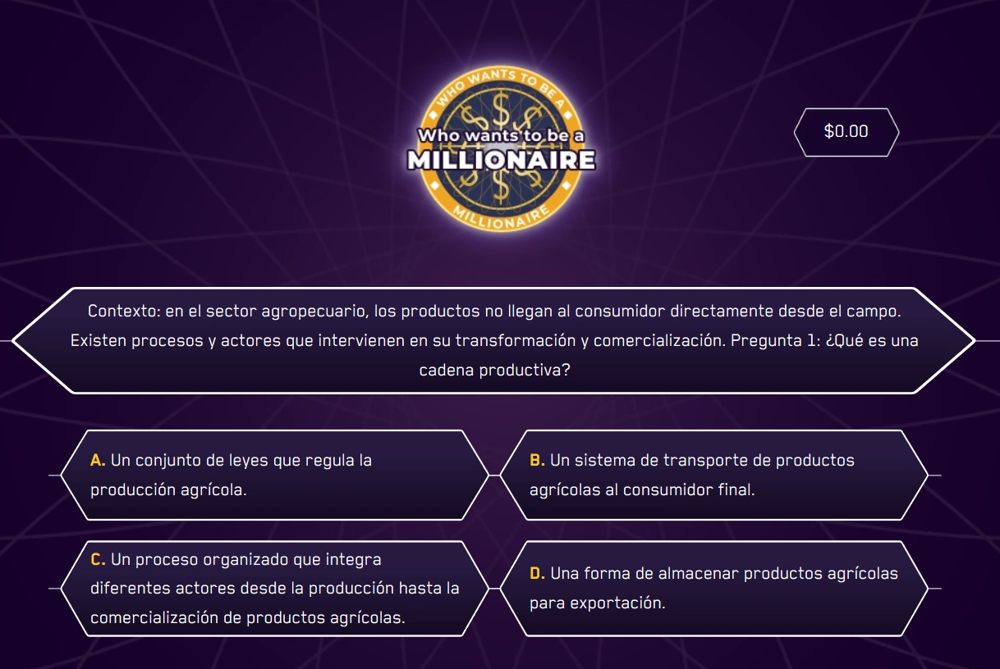

`GameMillions` es el componente que envuelve y gestiona el juego interactivo estilo "Quién Quiere Ser Millonario". Coordina la validación de las opciones elegidas, el puntaje actual (dinero) y maneja el estado de la pregunta activa. Se divide en los subcomponentes `GameMilions.Element` para las opciones y `GameMilions.Button` para las acciones.

## Vista previa



## Cómo implementar en un OVA

### 1. Importa los componentes

En tu archivo `.tsx` del OVA, importa todo lo necesario para montar el componente y su gamificación:

```tsx
import { useState } from 'react';
import { Audio, Col, Row } from 'books-ui';
import { Avatar, AvatarVariation } from '@features/avatar';
import { useGamification } from '@features/gamification';
import { ToastFeedback } from '@features/toast-feedback';
import { GameMilions } from '@games/game-millions';
import { Panel } from '@layouts';
import { Button } from '@ui';
```

---

### 2. Define las constantes

Declara los identificadores de los modales para las notificaciones de éxito o error:

```tsx
const MODALS = {
  SUCCESS: 'modal-correct-activity',
  WRONG: 'modal-wrong-activity'
};
```

---

### 3. Configura los hooks

Dentro del componente, inicializa los estados necesarios (incluyendo el acumulado de dinero) y el hook de gamificación:

```tsx
const [isOpen, setIsOpen] = useState<string | null>(null);
const [money, setMoney] = useState(0);

const { Modal, notifyReset, reportResult } = useGamification({
  id: 'ova-08-millions-1', // ID único por OVA
  total: 1 // o el total de preguntas a responder
});
```

---

### 4. Crea el handler de validación

Esta función procesa el resultado del `GameMillions` y abre el _Feedback_ correspondiente, además de guardar la puntuación usando `reportResult`:

```tsx
const handleValidate = ({ result, options }: { result: boolean, options: any[] }) => {
  const activityResult = result ? 'SUCCESS' : 'WRONG';
  setIsOpen(MODALS[activityResult as keyof typeof MODALS]);

  reportResult({
    success: result,
    correct: result ? 1 : 0,
    total: 1
  });
};

const closeModal = () => setIsOpen(null);
```

---

### 5. Construye la actividad

Estructura tu vista utilizando `<GameMilions>`, declarando las opciones de la pregunta y los botones:

```tsx
<GameMilions
  question={<p>¿Cuál es el planeta más grande del sistema solar?</p>}
  money={money}
  alt={
    <p>
     <strong>Animación 1.</strong> Actividad de aprendizaje.
    </p>}
  onResult={handleValidate}
  onMoneyChange={setMoney}>

  {/* Opciones de respuesta */}
  <GameMilions.Element id="opt-1" name="q1" label="Tierra" state="wrong" />
  <GameMilions.Element id="opt-2" name="q1" label="Marte" state="wrong" />
  <GameMilions.Element id="opt-3" name="q1" label="Júpiter" state="success" />
  <GameMilions.Element id="opt-4" name="q1" label="Saturno" state="wrong" />

  {/* Botones de acción */}
  <Row justifyContent="center" alignItems="center" addClass="u-gap-x-6 u-mt-5">
    <GameMilions.Button type="check">
      <Button label="Comprobar" variant="check" />
    </GameMilions.Button>

    <GameMilions.Button type="reset">
      <Button label="Reintentar" variant="reset" onClick={notifyReset} />
    </GameMilions.Button>
  </Row>

</GameMilions>
```

---

### 6. Agrega los modales de feedback

Junto a la estructura de tu vista, agrega el modal principal de gamificación y los respectivos `ToastFeedback`:

```tsx
{/* Modal de gamificación (éxito final del OVA/Actividad) */}
<Modal audio="assets/audios/content/aud_bien.mp3" interpreter={{ contentURL: '', a11yURL: '' }} />

{/* Feedback de error */}
<ToastFeedback
  type="wrong"
  isOpen={isOpen === MODALS.WRONG}
  onClose={closeModal}
  audio="assets/audios/content/aud_incorrecto.mp3">
  <p>Respuesta incorrecta, revisa bien las opciones e inténtalo de nuevo.</p>
</ToastFeedback>

{/* Feedback de acierto */}
<ToastFeedback
  type="success"
  isOpen={isOpen === MODALS.SUCCESS}
  onClose={closeModal}
  audio="assets/audios/content/aud_correcto.mp3">
  <p>¡Correcto! Has ganado 1.000.000$.</p>
</ToastFeedback>
```

---

## Props de GameMilions

| Prop | Tipo | Req. | Descripción |
|---|---|---|---|
| `question` | `ReactNode` \| `JSX.Element` | ✓ | Elemento o texto con la pregunta a responder. |
| `money` | `number` | ✓ | Cantidad de dinero (puntaje actual) que se mostrará. |
| `alt` | `ReactNode` \| `JSX.Element` | ✓ | Texto alternativo o descripción para la actividad (accesibilidad). |
| `onResult` | `({ result, options }) => void` | | Función callback llamada cuando se verifica la respuesta. Recibe un booleano `result` y el arreglo `options`. |
| `onMoneyChange` | `(value: number) => void` | | Callback que se gatilla tras una comprobación, recibiendo el nuevo valor de `money`. |
| `onQuestionChange` | `(index: number) => void` | | Evento al cambiar de pregunta/nivel (útil para gestionar multipartes). |

## Props de GameMilions.Element

Representa cada una de las opciones a elegir dentro del juego.

| Prop | Tipo | Req. | Descripción |
|---|---|---|---|
| `id` | `string` | | Identificador único del elemento. Automático si no se da. |
| `name` | `string` | ✓ | Nombre del grupo de opciones de radio al que pertenece. |
| `label` | `string` | ✓ | El texto que se presentará como la opción de respuesta. |
| `state` | `"success"` \| `"wrong"` | ✓ | Define si esta opción es la respuesta correcta (`success`) o no (`wrong`). |

## Props de GameMilions.Button

Sirve de wrapper controlador de los botones de interacción interna.

| Prop | Tipo | Req. | Descripción |
|---|---|---|---|
| `type` | `"check"` \| `"reset"` \| `"next"` | ✓ | Define la acción del botón dentro de la mecánica del juego. |
| `children` | `ReactElement` | ✓ | Generalmente un `<Button>` u otro componente pulsable al que se le inyectarán las propiedades. |
