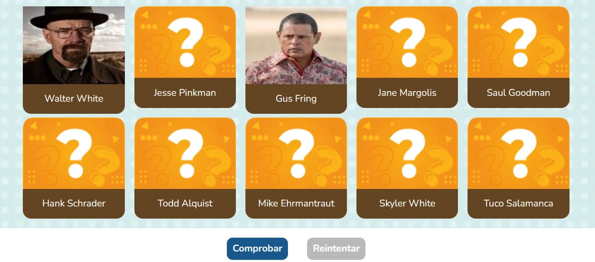
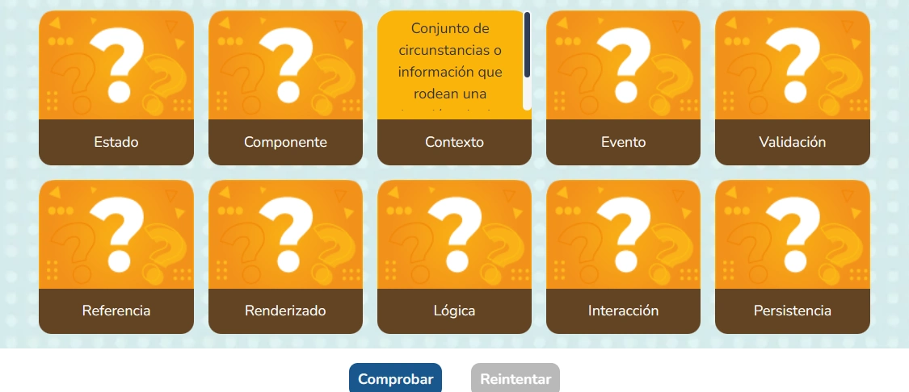
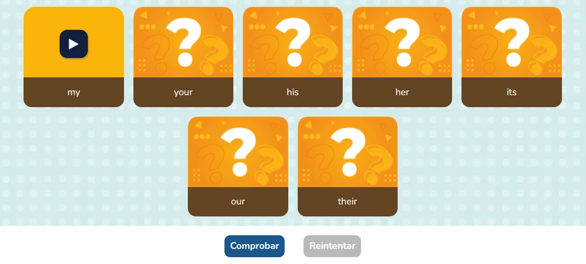

import CoreRepoInfo from '../../../components/CoreRepoInfo.astro';

`PhraseAndImage` es el componente raíz para crear actividades donde el estudiante asocia frases o preguntas con imágenes, textos o audios. Gestiona el estado de selección, validación y resultado. Se compone de cinco subcomponentes: `PhraseAndImage.Modal`, `PhraseAndImage.selectImage`, `PhraseAndImage.selectText`, `PhraseAndImage.selectAudio` y `PhraseAndImage.Button`.

:::note[Tres variaciones según el tipo de respuesta]
`PhraseAndImage` tiene tres modos definidos con el prop `type`. Cada modo usa un subcomponente de selección diferente:
- **`"image"`** — las opciones son imágenes. Usa `PhraseAndImage.selectImage`
- **`"text"`** — las opciones son textos. Usa `PhraseAndImage.selectText`
- **`"audio"`** — las opciones son audios. Usa `PhraseAndImage.selectAudio`
:::

## Vista previa

### Tipo imagen

El estudiante asocia cada frase con su imagen correspondiente seleccionándola del panel de opciones.



### Tipo texto

El estudiante asocia cada frase con su respuesta en texto seleccionándola del panel de opciones.



### Tipo audio

El estudiante asocia cada frase con su audio correspondiente reproduciéndolo desde el panel de opciones.



## El prop `join` — cómo funciona la asociación

Antes de implementar, es importante entender el `join`. Es el mecanismo central que conecta cada tarjeta de pregunta con su opción correcta usando el mismo número. **Tanto la tarjeta como su opción deben tener el mismo `join`.**

```
initialCards[0] → join: 1  ←→  selectImage join={1}  ✅ par correcto
initialCards[1] → join: 2  ←→  selectImage join={2}  ✅ par correcto
initialCards[0] → join: 1  ←→  selectImage join={3}  ❌ par incorrecto
```

Si necesitas agregar un distractor (una opción que no corresponde a ninguna tarjeta), dale un `join` que no exista en ninguna tarjeta del `initialCards`. Por ejemplo, si tienes 3 tarjetas con `join: 1, 2, 3`, el distractor puede tener `join={4}`.

## Cómo implementar en un OVA

### 1. Importa los componentes

```tsx
import { useState } from 'react';
import { PhraseAndImage } from '@games/game-phrase-and-image';
import { useGamification } from '@features/gamification';
import { ToastFeedback } from '@features/toast-feedback';
import { Button } from '@ui';
```

---

### 2. Define las constantes y las tarjetas iniciales

A diferencia de otros juegos, `PhraseAndImage` requiere definir los datos de las tarjetas **fuera del componente**, como constantes. Hay tres tipos de arrays según la variación que vayas a usar:

```tsx
const MODALS = {
  SUCCESS: 'modal-correct-activity',
  WRONG: 'modal-wrong-activity'
};

const LENGTH_QUESTION = 3;

// Para type="image" — requiere text, join, state, url y alt
const initialCards = [
  { text: '¿Pregunta 1?', join: 1, state: null, url: 'assets/images/pregunta-1.png', alt: 'Pregunta 1' },
  { text: '¿Pregunta 2?', join: 2, state: null, url: 'assets/images/pregunta-2.png', alt: 'Pregunta 2' },
  { text: '¿Pregunta 3?', join: 3, state: null, url: 'assets/images/pregunta-3.png', alt: 'Pregunta 3' }
];

// Para type="text" — solo requiere text, join y state (sin url ni alt)
const initialCardsText = [
  { text: 'El animal que maúlla es...', join: 1, state: null },
  { text: 'El animal que ladra es...', join: 2, state: null }
];

// Para type="audio" — solo requiere text, join y state (sin url ni alt)
const initialCardsSound = [
  { text: '¿Qué sonido corresponde al primer animal?', join: 1, state: null },
  { text: '¿Cuál es el instrumento de la segunda melodía?', join: 2, state: null }
];
```

> Define solo el array que corresponde a la variación que vas a usar. No es necesario definir los tres.

---

### 3. Configura los hooks

```tsx
const [isOpen, setIsOpen] = useState<string | null>(null);

const { Modal, Stars, notifyReset, reportResult } = useGamification({
  id: 'ova-01-activity-1', // debe ser único por actividad
  total: LENGTH_QUESTION
});
```

:::tip[El `id` de gamificación debe ser único por actividad]
Usa el patrón `ova-[número]-activity-[número]` para mantener consistencia y evitar conflictos en el sistema de puntuación.
:::

---

### 4. Crea el handler de validación

```tsx
const handleValidate = ({ result }: { result: boolean }) => {
  const activityResult = result ? 'SUCCESS' : 'WRONG';
  setIsOpen(MODALS[activityResult as keyof typeof MODALS]);

  reportResult({
    success: result,
    correct: result ? 1 : 0,
    total: 1
  });
};

const closeModal = () => setIsOpen(null);
```

:::caution[Cómo pasar `onResult` correctamente]
La forma de conectar `onResult` con `handleValidate` es la misma para las tres variaciones:

```tsx
// ✅ Correcto para type="image", type="text" y type="audio"
onResult={(result) => handleValidate({ result })}

// ❌ Incorrecto — no invoca la función, solo la referencia
onResult={() => handleValidate}
```
:::

---

### 5. Construye la actividad según el tipo

#### Variación `type="image"` — opciones con imágenes

El estudiante ve una lista de frases a la izquierda y un panel de imágenes a la derecha. Debe arrastrar o seleccionar la imagen que corresponde a cada frase.

Cada `selectImage` necesita un `id` numérico secuencial (0, 1, 2...), un `join` que coincida con la tarjeta correcta, la ruta de la imagen y su texto alternativo:

```tsx
<PhraseAndImage
  type="image"
  numCorrects={3}
  initialCards={initialCards}
  onResult={(result) => handleValidate({ result })}>

  <PhraseAndImage.Modal>
    {/* id es el índice de la imagen (0, 1, 2...) */}
    {/* join debe coincidir con el join de la tarjeta correcta en initialCards */}
    <PhraseAndImage.selectImage id={0} join={1} url="assets/images/opcion-a.png" alt="Opción A" />
    <PhraseAndImage.selectImage id={1} join={2} url="assets/images/opcion-b.png" alt="Opción B" />
    <PhraseAndImage.selectImage id={2} join={3} url="assets/images/opcion-c.png" alt="Opción C" />
    {/* Distractor — join={4} no existe en ninguna tarjeta de initialCards */}
    <PhraseAndImage.selectImage id={3} join={4} url="assets/images/distractor.png" alt="Distractor" />
  </PhraseAndImage.Modal>

  <Row justifyContent="center" addClass="u-gap-4 u-mt-4">
    <PhraseAndImage.Button>
      <Button label="COMPROBAR" variant="check" />
    </PhraseAndImage.Button>
    <PhraseAndImage.Button type="reset">
      <Button label="REINICIAR" onClick={notifyReset} />
    </PhraseAndImage.Button>
  </Row>
</PhraseAndImage>
```

---

#### Variación `type="text"` — opciones con textos

El estudiante ve las frases a la izquierda y un panel de respuestas en texto a la derecha. Debe asociar cada frase con su texto correcto.

A diferencia de `selectImage`, `selectText` no tiene `id` — solo `join`. Su contenido es JSX libre, así que puedes poner `<span>`, `<strong>`, `<p>` o lo que necesites:

```tsx
<PhraseAndImage
  type="text"
  numCorrects={2}
  initialCards={initialCardsText}
  onResult={(result) => handleValidate({ result })}>

  <PhraseAndImage.Modal>
    {/* join debe coincidir con el join de la tarjeta correcta en initialCardsText */}
    <PhraseAndImage.selectText join={1}>
      <span>El gato</span>
    </PhraseAndImage.selectText>
    <PhraseAndImage.selectText join={2}>
      <span>El perro</span>
    </PhraseAndImage.selectText>
    {/* Distractor — join={3} no existe en initialCardsText */}
    <PhraseAndImage.selectText join={3}>
      <span>El pájaro</span>
    </PhraseAndImage.selectText>
  </PhraseAndImage.Modal>

  <Row justifyContent="center" addClass="u-gap-4 u-mt-4">
    <PhraseAndImage.Button>
      <Button label="COMPROBAR" variant="check" />
    </PhraseAndImage.Button>
    <PhraseAndImage.Button type="reset">
      <Button label="REINICIAR" onClick={notifyReset} />
    </PhraseAndImage.Button>
  </Row>
</PhraseAndImage>
```

---

#### Variación `type="audio"` — opciones con audios

El estudiante ve las frases a la izquierda y un panel de botones de audio a la derecha. Reproduce cada audio y lo asocia con la frase correcta.

Similar a `selectImage`, `selectAudio` necesita `id` numérico secuencial, `join` y la ruta del audio:

```tsx
<PhraseAndImage
  type="audio"
  numCorrects={2}
  initialCards={initialCardsSound}
  onResult={(result) => handleValidate({ result })}>

  <PhraseAndImage.Modal>
    {/* id es el índice del audio (0, 1, 2...) */}
    {/* join debe coincidir con el join de la tarjeta correcta en initialCardsSound */}
    <PhraseAndImage.selectAudio id={0} join={1} urlAudio="assets/audios/sonido-gato.mp3" />
    <PhraseAndImage.selectAudio id={1} join={2} urlAudio="assets/audios/sonido-piano.mp3" />
    {/* Distractor */}
    <PhraseAndImage.selectAudio id={2} join={3} urlAudio="assets/audios/distractor.mp3" />
  </PhraseAndImage.Modal>

  <Row justifyContent="center" addClass="u-gap-4 u-mt-4">
    <PhraseAndImage.Button>
      <Button label="COMPROBAR" variant="check" />
    </PhraseAndImage.Button>
    <PhraseAndImage.Button type="reset">
      <Button label="REINICIAR" onClick={notifyReset} />
    </PhraseAndImage.Button>
  </Row>
</PhraseAndImage>
```

---

### 6. Agrega los modales de feedback

```tsx
<Modal audio="assets/audios/content/aud_bien.mp3" />

<ToastFeedback
  type="success"
  isOpen={isOpen === MODALS.SUCCESS}
  onClose={closeModal}
  audio="assets/audios/content/aud_correcto.mp3">
  <p>¡Muy bien! Asociaste correctamente todas las frases.</p>
</ToastFeedback>

<ToastFeedback
  type="wrong"
  isOpen={isOpen === MODALS.WRONG}
  onClose={closeModal}
  audio="assets/audios/content/aud_incorrecto.mp3">
  <p>Revisa las asociaciones e intenta de nuevo.</p>
</ToastFeedback>
```

---

## Subcomponentes

### `PhraseAndImage`

Contenedor raíz. El `type` define el modo del juego y qué subcomponente de selección usar dentro de `Modal`.

| Prop | Tipo | Req. | Descripción |
|---|---|---|---|
| `type` | `"image" \| "text" \| "audio"` | ✓ | Define la variación del juego |
| `initialCards` | `CardItem[]` | ✓ | Array de tarjetas de preguntas. Los campos requeridos varían según el `type` |
| `numCorrects` | `number` | ✓ | Número de asociaciones correctas necesarias para superar la actividad |
| `onResult` | `(result: boolean) => void` | | Callback al comprobar. Recibe directamente el booleano del resultado |

<CoreRepoInfo corePath="components/games/game-phrase-and-image/phrase-and-image.tsx" />

---

### `PhraseAndImage.Modal`

Contenedor de las opciones de respuesta. Siempre va dentro de `<PhraseAndImage>`, antes de los botones.

<CoreRepoInfo corePath="components/games/game-phrase-and-image/pharase-and-image-modal.tsx" />

---

### `PhraseAndImage.selectImage`

Opción de tipo imagen. Solo usar cuando `type="image"`.

| Prop | Tipo | Req. | Descripción |
|---|---|---|---|
| `id` | `number` | ✓ | Índice secuencial de la opción: `0`, `1`, `2`... Debe ser único entre los `selectImage` |
| `join` | `number` | ✓ | Número que empareja esta imagen con la tarjeta del `initialCards` que tenga el mismo `join` |
| `url` | `string` | ✓ | Ruta de la imagen |
| `alt` | `string` | ✓ | Texto alternativo accesible de la imagen |

<CoreRepoInfo corePath="components/games/game-phrase-and-image/image-element.tsx" />

---

### `PhraseAndImage.selectText`

Opción de tipo texto. Solo usar cuando `type="text"`. Acepta cualquier JSX como contenido hijo.

| Prop | Tipo | Req. | Descripción |
|---|---|---|---|
| `join` | `number` | ✓ | Número que empareja este texto con la tarjeta del `initialCards` que tenga el mismo `join` |

<CoreRepoInfo corePath="components/games/game-phrase-and-image/text-element.tsx" />

---

### `PhraseAndImage.selectAudio`

Opción de tipo audio. Solo usar cuando `type="audio"`.

| Prop | Tipo | Req. | Descripción |
|---|---|---|---|
| `id` | `number` | ✓ | Índice secuencial del audio: `0`, `1`, `2`... Debe ser único entre los `selectAudio` |
| `join` | `number` | ✓ | Número que empareja este audio con la tarjeta del `initialCards` que tenga el mismo `join` |
| `urlAudio` | `string` | ✓ | Ruta del archivo de audio |

<CoreRepoInfo corePath="components/games/game-phrase-and-image/audio-element.tsx" />

---

### `PhraseAndImage.Button`

Botón de acción. Siempre va dentro de `<PhraseAndImage>`, fuera del `Modal`.

| Prop | Tipo | Req. | Descripción |
|---|---|---|---|
| `type` | `"reset"` | | Sin valor comprueba y dispara `onResult`. Con `"reset"` reinicia todas las asociaciones |

<CoreRepoInfo corePath="components/games/game-phrase-and-image/phrase-and-image-button.tsx" />