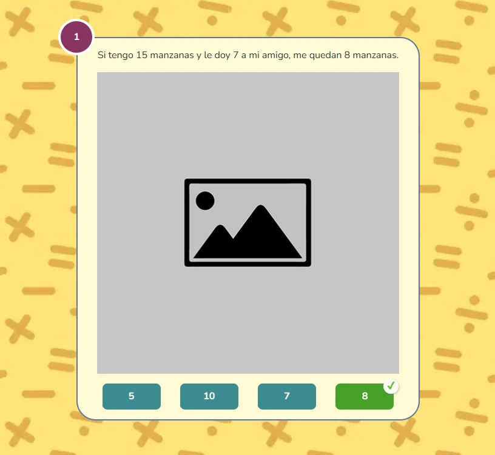

import CoreRepoInfo from '../../../components/CoreRepoInfo.astro';

`GameQuestion` es el componente raíz para crear preguntas de selección múltiple presentadas en una tarjeta con imagen y respuestas cortas. Gestiona el estado de selección, validación y resultado. Se compone de tres subcomponentes: `GameQuestion.Card`, `GameQuestion.Radio` y `GameQuestion.Button`.

:::caution[Diseñado para respuestas cortas con imagen]
`GameQuestion` está pensado para preguntas que tienen una imagen de apoyo y opciones de respuesta breves (palabras, números o frases muy cortas). Para respuestas largas usa `GameMoney` o `GameSpace`.
:::

## Vista previa



## Cómo implementar en un OVA

### 1. Importa los componentes

```tsx
import { useState } from 'react';
import { GameQuestion } from '@games/game-question';
import { useGamification } from '@features/gamification';
import { ToastFeedback } from '@features/toast-feedback';
import { Button } from '@ui';
```

---

### 2. Define las constantes

```tsx
const MODALS = {
  SUCCESS: 'modal-correct-activity',
  WRONG: 'modal-wrong-activity'
};

const LENGTH_QUESTION = 1; // total de preguntas
```

---

### 3. Configura los hooks

```tsx
const [isOpen, setIsOpen] = useState<string | null>(null);

const { Modal, Stars, notifyReset, reportResult } = useGamification({
  id: 'ova-01-activity-1', // debe ser único por actividad
  total: LENGTH_QUESTION
});
```

:::tip[El `id` de gamificación debe ser único por actividad]
Usa el patrón `ova-[número]-activity-[número]` para mantener consistencia y evitar conflictos en el sistema de puntuación.
:::

---

### 4. Crea el handler de validación

```tsx
const handleValidate = ({ result }: { result: boolean }) => {
  const activityResult = result ? 'SUCCESS' : 'WRONG';
  setIsOpen(MODALS[activityResult as keyof typeof MODALS]);

  reportResult({
    success: result,
    correct: LENGTH_QUESTION,
    total: LENGTH_QUESTION
  });
};

const closeModal = () => setIsOpen(null);
```

---

### 5. Construye la actividad

La actividad se arma en tres partes dentro de `<GameQuestion>`.

**5a. La tarjeta con su pregunta** — `GameQuestion.Card` recibe la pregunta en `question` y envuelve las opciones. Opcionalmente acepta una imagen de fondo y número de pregunta:

```tsx
<GameQuestion.Card
  question="Si tengo 15 manzanas y le doy 7 a mi amigo, me quedan ___ manzanas."
  imagen="assets/images/manzanas.webp"
  questionNumber="1"
  background="assets/images/bg-card.webp">
  {/* opciones van aquí */}
</GameQuestion.Card>
```

> El texto `___` (tres o más guiones bajos) en `question` se reemplaza automáticamente con la opción seleccionada por el estudiante, mostrando la oración completa en tiempo real.

**5b. Las opciones** — cada `GameQuestion.Radio` es una opción corta. Van dentro de `Card`:

```tsx
<GameQuestion.Card question="Si tengo 15 manzanas y le doy 7 a mi amigo, me quedan ___ manzanas.">
  <GameQuestion.Radio id="option-1-1" name="option-1" state="wrong"   label="5" />
  <GameQuestion.Radio id="option-1-2" name="option-1" state="wrong"   label="7" />
  <GameQuestion.Radio id="option-1-3" name="option-1" state="success" label="8" />
  <GameQuestion.Radio id="option-1-4" name="option-1" state="wrong"   label="10" />
</GameQuestion.Card>
```

> `state="success"` marca la opción correcta. `state="wrong"` las incorrectas. El `name` debe ser igual en todas las opciones de la misma tarjeta. El `id` debe ser único en toda la página.

:::tip[Usa `___` para preguntas de completar]
Si la pregunta tiene un espacio en blanco (`___`), el componente reemplaza automáticamente ese blanco con la opción que el estudiante seleccione. Ideal para preguntas de completar la oración.

```tsx
// La pregunta muestra: "Si tengo 15 manzanas y le doy 7 a mi amigo, me quedan ___ manzanas."
// Al seleccionar "8" se actualiza a: "Si tengo 15 manzanas y le doy 7 a mi amigo, me quedan 8 manzanas."
question="Si tengo 15 manzanas y le doy 7 a mi amigo, me quedan ___ manzanas."
```

Si la pregunta no tiene `___`, se muestra tal cual sin reemplazo.
:::

**5c. Los botones de acción** — van fuera de `Card` pero dentro de `<GameQuestion>`:

```tsx
<Row justifyContent="center" alignItems="center" addClass="u-gap-4">
  <GameQuestion.Button>
    <Button label="COMPROBAR" variant="check" />
  </GameQuestion.Button>
  <GameQuestion.Button type="reset">
    <Button label="REINICIAR" onClick={notifyReset} variant="reset" />
  </GameQuestion.Button>
</Row>
```

**5d. Todo junto:**

```tsx
<GameQuestion onResult={handleValidate}>

  {/* 5a y 5b — tarjeta con opciones */}
  <GameQuestion.Card
    question="Si tengo 15 manzanas y le doy 7 a mi amigo, me quedan ___ manzanas."
    imagen="assets/images/manzanas.webp"
    questionNumber="1">
    <GameQuestion.Radio id="option-1-1" name="option-1" state="wrong"   label="5" />
    <GameQuestion.Radio id="option-1-2" name="option-1" state="wrong"   label="7" />
    <GameQuestion.Radio id="option-1-3" name="option-1" state="success" label="8" />
    <GameQuestion.Radio id="option-1-4" name="option-1" state="wrong"   label="10" />
  </GameQuestion.Card>

  {/* 5c — botones */}
  <Row justifyContent="center" alignItems="center" addClass="u-gap-4">
    <GameQuestion.Button>
      <Button label="COMPROBAR" variant="check" />
    </GameQuestion.Button>
    <GameQuestion.Button type="reset">
      <Button label="REINICIAR" onClick={notifyReset} variant="reset" />
    </GameQuestion.Button>
  </Row>

</GameQuestion>
```

---

### 6. Agrega los modales de feedback

```tsx
<Modal
  audio="assets/audios/content/aud_gr1_ova-01_sld-1 (Bien).mp3"
  interpreter={{ contentURL: 'content/vid_int_ova-01_sld-1 (Bien).mp4' }}
/>

<ToastFeedback
  type="wrong"
  isOpen={isOpen === MODALS.WRONG}
  onClose={closeModal}
  interpreter={{ contentURL: 'content/vid_int_ova-01_sld-1 (Incorrecto).mp4' }}
  audio="assets/audios/content/aud_gr1_ova-01_sld-1 (Incorrecto).mp3">
  <p>Revisa el contenido e intenta de nuevo.</p>
</ToastFeedback>

<ToastFeedback
  type="success"
  isOpen={isOpen === MODALS.SUCCESS}
  onClose={closeModal}
  interpreter={{ contentURL: 'content/vid_int_ova-01_sld-1 (Correcto).mp4' }}
  audio="assets/audios/content/aud_gr1_ova-01_sld-1 (Correcto).mp3">
  <p>¡Muy bien! Has respondido correctamente.</p>
</ToastFeedback>
```

---

## Subcomponentes

### `GameQuestion`

Contenedor raíz. Gestiona el estado global de selección y validación.

| Prop | Tipo | Req. | Descripción |
|---|---|---|---|
| `onResult` | `({ result, options }) => void` | | Callback al comprobar. Recibe `result` (boolean) y el array de opciones seleccionadas |
| `minSelected` | `number` | | Mínimo de opciones seleccionadas para habilitar Comprobar. Por defecto `1` |

<CoreRepoInfo corePath="components/games/game-question/game-question.tsx" />

---

### `GameQuestion.Card`

Tarjeta visual que contiene la pregunta y las opciones. Soporta imagen de fondo y número de pregunta.

| Prop | Tipo | Req. | Descripción |
|---|---|---|---|
| `question` | `string` | ✓ | Texto de la pregunta. Usa `___` para crear un espacio en blanco que se rellena con la opción seleccionada |
| `imagen` | `string` | | Ruta de la imagen de apoyo que se muestra en la tarjeta |
| `background` | `string` | | Ruta de la imagen de fondo de la tarjeta |
| `questionNumber` | `string` | | Número visible de la pregunta |
| `addClass` | `string` | | Clases utilitarias adicionales para el contenedor |

<CoreRepoInfo corePath="components/games/game-question/game-question-card.tsx" />

---

### `GameQuestion.Radio`

Cada opción de respuesta. Pensado para respuestas cortas: palabras, números o frases breves.

| Prop | Tipo | Req. | Descripción |
|---|---|---|---|
| `id` | `string` | ✓ | Identificador único en toda la página |
| `name` | `string` | ✓ | Agrupa las opciones de la misma tarjeta. Igual en todos los radios del mismo `Card` |
| `label` | `string` | ✓ | Texto visible de la opción. Preferiblemente corto |
| `state` | `"success" \| "wrong"` | ✓ | Define si la opción es correcta o incorrecta |

> Debe haber exactamente un `state="success"` por tarjeta.

<CoreRepoInfo corePath="components/games/game-question/game-question-radio.tsx" />

---

### `GameQuestion.Button`

Botón de acción. Siempre debe ir dentro de `<GameQuestion>`, fuera del `Card`.

| Prop | Tipo | Req. | Descripción |
|---|---|---|---|
| `type` | `"reset"` | | Sin valor comprueba y dispara `onResult`. Con `"reset"` reinicia la selección |

<CoreRepoInfo corePath="components/games/game-question/game-question-button.tsx" />
