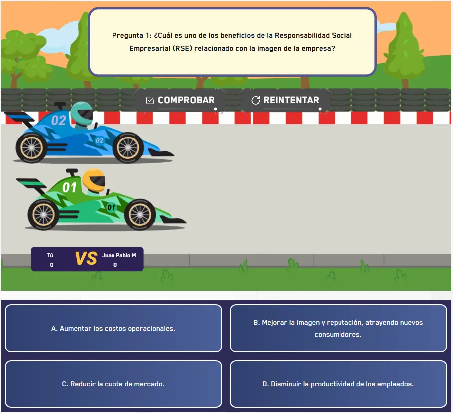

`RaceCard` es el componente raíz que envuelve toda la actividad de carrera. El estudiante responde preguntas de selección múltiple y por cada respuesta correcta su auto avanza en la pista superando al competidor. Gestiona el conteo de preguntas y el progreso de la carrera. Se compone de cuatro subcomponentes: `RaceCard.Init`, `RaceCard.Scene`, `RaceCard.Radio` y el `RaceCard` raíz como wrapper global.

## Vista previa



## Cómo implementar en un OVA

### 1. Importa los componentes

```tsx
import { useState } from 'react';
import { RaceCard } from '@games/game-race-card';
import { useGamification } from '@features/gamification';
import { ToastFeedback } from '@features/toast-feedback';
```

---

### 2. Define las constantes

```tsx
const MODALS = {
  TRUE: 'modal-correct-activity',
  FALSE: 'modal-wrong-activity'
};

const LENGTH_QUESTION = 5; // total de preguntas
```

---

### 3. Configura los hooks

```tsx
const [isOpen, setIsOpen] = useState<string | null>(null);

const { Modal, Stars, notifyReset, reportResult } = useGamification({
  id: 'ova-97-activity-2',
  total: 5
});
```

:::tip[El `id` de gamificación debe ser único por actividad]
Cada actividad del proyecto debe tener un `id` diferente. Usa el patrón `ova-[número]-activity-[número]` para mantener consistencia.
:::

---

### 4. Crea el handler de validación

```tsx
const handleValidate = ({ result }: { result: boolean }) => {
  const activityResult = result.toString().toUpperCase();
  setIsOpen(MODALS[activityResult as keyof typeof MODALS]);

  reportResult({
    success: result,
    correct: LENGTH_QUESTION,
    total: LENGTH_QUESTION
  });
};

const closeModal = () => setIsOpen(null);
```

---

### 5. Construye la actividad

La actividad se estructura en tres partes. A diferencia de los otros juegos, `RaceCard` envuelve todo el layout incluyendo el `Panel`.

**5a. El wrapper global** — `<RaceCard>` envuelve todo el componente y recibe el total de preguntas. Va por fuera del `Panel`:

```tsx
<RaceCard questionCount={LENGTH_QUESTION}>
  <Panel stars={Stars}>
    {/* secciones aquí */}
  </Panel>
</RaceCard>
```

> `questionCount` le dice al juego cuántas preguntas hay en total para calcular el avance del auto en la pista.

**5b. Pantalla de instrucciones** — `RaceCard.Init` va en la primera sección del `Panel`. Acepta HTML en su mensaje:

```tsx
<RaceCard.Init
  messageInitial="Lee cada pregunta con atención y selecciona la respuesta correcta para avanzar en la pista superando el auto de Juan Pablo Montoya.<br />¡Mucho éxito!"
/>
```

> `RaceCard.Init` solo muestra las instrucciones y la animación inicial. No va dentro de `<RaceCard.Scene>`.

**5c. Cada pregunta con su escena** — `RaceCard.Scene` contiene la pregunta, la animación de carrera y las opciones. Va en secciones separadas del `Panel`:

```tsx
<RaceCard.Scene
  onResult={handleValidate}
  notifyReset={notifyReset}
  question="Pregunta 1: ¿Cuál es uno de los beneficios de la RSE relacionado con la imagen de la empresa?"
  id="question-svg-1"
  drivers={{ machine: 'Juan Pablo M' }}>

  <RaceCard.Radio id="1-1" name="option-1" label="A. Aumentar los costos operacionales."                              state="wrong" />
  <RaceCard.Radio id="1-2" name="option-1" label="B. Mejorar la imagen y reputación, atrayendo nuevos consumidores."  state="success" />
  <RaceCard.Radio id="1-3" name="option-1" label="C. Reducir la cuota de mercado."                                    state="wrong" />
  <RaceCard.Radio id="1-4" name="option-1" label="D. Disminuir la productividad de los empleados."                    state="wrong" />

</RaceCard.Scene>
```

> `drivers.machine` es el nombre del competidor que aparece en la animación. `notifyReset` viene del hook de gamificación y se pasa directamente a la escena — los botones Comprobar y Reiniciar los maneja `RaceCard.Scene` internamente, no necesitas agregarlos manualmente.

:::caution[El id de la escena es obligatorio y debe seguir el patrón `question-svg-N`]
El juego usa `id^="question-svg-"` para ubicar la escena activa en el DOM. Si el `id` no sigue este patrón exacto, la animación de la carrera no funcionará correctamente.

```tsx
// ✅ Correcto
<RaceCard.Scene id="question-svg-1" ... />
<RaceCard.Scene id="question-svg-2" ... />

// ❌ Incorrecto
<RaceCard.Scene id="scene-1" ... />
<RaceCard.Scene id="question-1" ... />
```
:::

**5d. Todo junto** — una pregunta por sección del `Panel`:

```tsx
<RaceCard questionCount={LENGTH_QUESTION}>
  <Panel stars={Stars}>

    {/* Sección de instrucciones */}
    <Panel.Section interpreter={{ ... }}>
      <figure>
        <RaceCard.Init messageInitial="Lee cada pregunta y selecciona la respuesta correcta para avanzar en la pista.<br />¡Mucho éxito!" />
        <figcaption><p><strong>Animación 1. </strong>Instrucciones.</p></figcaption>
      </figure>
    </Panel.Section>

    {/* Pregunta 1 */}
    <Panel.Section interpreter={{ ... }}>
      <figure className="u-flow">
        <RaceCard.Scene
          onResult={handleValidate}
          notifyReset={notifyReset}
          question="Pregunta 1: ¿Cuál es uno de los beneficios de la RSE?"
          id="question-svg-1"
          drivers={{ machine: 'Juan Pablo M' }}>
          <RaceCard.Radio id="1-1" name="option-1" label="A. Aumentar costos."          state="wrong" />
          <RaceCard.Radio id="1-2" name="option-1" label="B. Mejorar la reputación."    state="success" />
          <RaceCard.Radio id="1-3" name="option-1" label="C. Reducir cuota de mercado." state="wrong" />
          <RaceCard.Radio id="1-4" name="option-1" label="D. Disminuir productividad."  state="wrong" />
        </RaceCard.Scene>
        <figcaption><p><strong>Animación 2. </strong>Actividad de aprendizaje.</p></figcaption>
      </figure>
    </Panel.Section>

    {/* Pregunta 2, 3, 4... mismo patrón */}

    <Modal audio="..." interpreter={{ contentURL: '...' }} />
    <ToastFeedback type="success" isOpen={isOpen === MODALS.TRUE} onClose={closeModal} ...>...</ToastFeedback>
    <ToastFeedback type="wrong"   isOpen={isOpen === MODALS.FALSE} onClose={closeModal} ...>...</ToastFeedback>

  </Panel>
</RaceCard>
```

---

### 6. Agrega los modales de feedback

```tsx
<Modal
  audio="assets/audios/content/aud_ova-97_sld-15 (Bien).mp3"
  interpreter={{ contentURL: 'content/vid_int_ova-97_sld-15 (Bien).mp4' }}
/>

<ToastFeedback
  type="success"
  isOpen={isOpen === MODALS.TRUE}
  onClose={closeModal}
  label="EXCELENTE"
  interpreter={{ contentURL: 'content/vid_int_ova-97_sld-15 (Correcto).mp4' }}
  audio="assets/audios/content/aud_ova-97_sld-15 (Correcto).mp3">
  <p>Has demostrado un buen dominio de los conceptos. ¡Felicidades!</p>
</ToastFeedback>

<ToastFeedback
  type="wrong"
  isOpen={isOpen === MODALS.FALSE}
  onClose={closeModal}
  interpreter={{ contentURL: 'content/vid_int_ova-97_sld-15 (Incorrecto).mp4' }}
  audio="assets/audios/content/aud_ova-97_sld-15 (Incorrecto).mp3">
  <p>¡Inténtalo de nuevo! Revisa el material del curso para escoger las respuestas correctas.</p>
</ToastFeedback>
```

---

## Subcomponentes

### `RaceCard`

Wrapper global que envuelve todo el OVA incluyendo el `Panel`. Controla el progreso de la carrera.

| Prop | Tipo | Req. | Descripción |
|---|---|---|---|
| `questionCount` | `number` | ✓ | Total de preguntas. Determina cuánto avanza el auto por cada respuesta correcta |

---

### `RaceCard.Init`

Pantalla de instrucciones y animación inicial. Va en la primera sección del `Panel`, fuera de `RaceCard.Scene`.

| Prop | Tipo | Req. | Descripción |
|---|---|---|---|
| `messageInitial` | `string` | ✓ | Texto de instrucciones. Acepta HTML (ej: `<br />`, `<strong>`) |

---

### `RaceCard.Scene`

Escena de cada pregunta. Incluye la animación de la pista, la pregunta y las opciones. Los botones Comprobar y Reiniciar son internos — no se agregan manualmente.

| Prop | Tipo | Req. | Descripción |
|---|---|---|---|
| `question` | `string` | ✓ | Texto de la pregunta |
| `id` | `string` | ✓ | Identificador único de la escena. **Debe seguir el patrón `question-svg-N`** (ej: `"question-svg-1"`) |
| `onResult` | `({ result: boolean }) => void` | ✓ | Callback al comprobar |
| `notifyReset` | `() => void` | ✓ | Función del hook de gamificación para notificar el reinicio |
| `drivers` | `{ machine: string }` | | Nombre del auto competidor que aparece en la animación |

---

### `RaceCard.Radio`

Cada opción de respuesta dentro de una escena.

| Prop | Tipo | Req. | Descripción |
|---|---|---|---|
| `id` | `string` | ✓ | Identificador único en toda la página |
| `name` | `string` | ✓ | Agrupa las opciones de la misma pregunta. Igual en todos los radios de la misma escena |
| `label` | `string` | ✓ | Texto visible de la opción |
| `state` | `"success" \| "wrong"` | ✓ | Define si la opción es correcta o incorrecta |

> Debe haber exactamente un `state="success"` por escena.