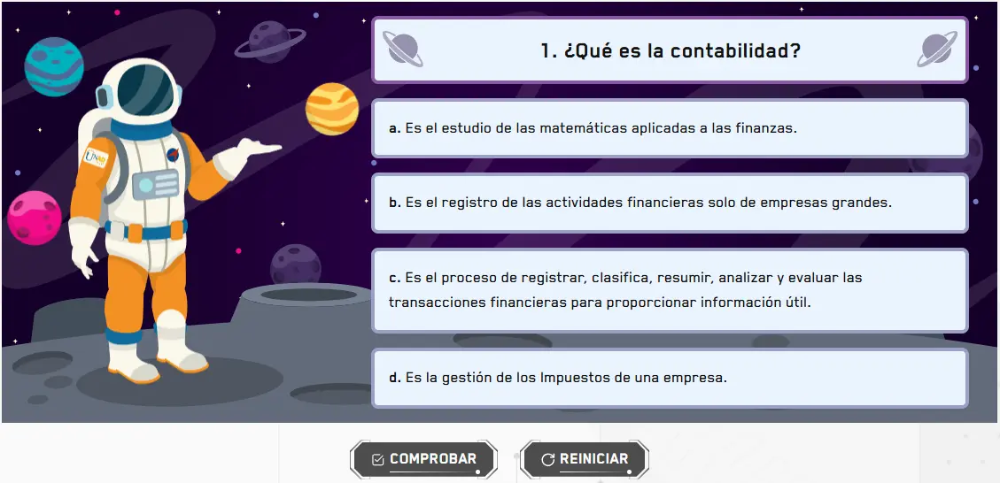

`GameSpace` es el componente raíz para crear preguntas de selección múltiple ambientadas en un universo espacial animado. El estudiante elige la respuesta correcta entre varias opciones mientras navega por una galaxia. Gestiona el estado de selección, validación y resultado. Se compone de tres subcomponentes: `GameSpace.Galaxy`, `GameSpace.Radio` y `GameSpace.Button`.

## Vista previa



## Cómo implementar en un OVA

### 1. Importa los componentes

```tsx
import { useState } from 'react';
import { GameSpace } from '@games/game-space';
import { useGamification } from '@features/gamification';
import { ToastFeedback } from '@features/toast-feedback';
import { Button } from '@ui';
```

---

### 2. Define las constantes

```tsx
const MODALS = {
  SUCCESS: 'modal-correct-activity',
  WRONG: 'modal-wrong-activity'
};

const LENGTH_QUESTION = 1; // total de preguntas
```

### 3. Configura los hooks
 
```tsx
const [isOpen, setIsOpen] = useState<string | null>(null);
 
const { Modal, Stars, notifyReset, reportResult } = useGamification({
  id: 'ova-01-activity-1',
  total: LENGTH_QUESTION
});
```
 
:::tip[El `id` de gamificación debe ser único por actividad]
Cada actividad del proyecto debe tener un `id` diferente. Usa el patrón `ova-[número]-activity-[número]` para mantener consistencia.
:::
 
---

### 4. Crea el handler de validación

```tsx
const handleValidate = ({ result }: { result: boolean }) => {
  const activityResult = result ? 'SUCCESS' : 'WRONG';
  setIsOpen(MODALS[activityResult as keyof typeof MODALS]);

  reportResult({
    success: result,
    correct: LENGTH_QUESTION,
    total: LENGTH_QUESTION
  });
};

const closeModal = () => setIsOpen(null);
```

---

### 5. Construye la actividad

La actividad tiene tres partes dentro de `<GameSpace>`.

**5a. La galaxia con su pregunta** — `GameSpace.Galaxy` recibe el texto de la pregunta en `question` y envuelve las opciones. El prop `universeType` define la variación visual del fondo:

```tsx
<GameSpace.Galaxy question="1. ¿Qué es la contabilidad?" universeType="1">
  {/* opciones van aquí */}
</GameSpace.Galaxy>
```

> `universeType` acepta `"1"` o `"2"`. Si se omite usa `2` por defecto. `question` también acepta JSX por si necesitas texto enriquecido: `question={<><strong>Pregunta:</strong> ¿Qué es...?</>}`.

**5b. Las opciones** — cada `GameSpace.Radio` es una opción seleccionable. Van dentro de `Galaxy`:

```tsx
<GameSpace.Galaxy question="1. ¿Qué es la contabilidad?" universeType="2">
  <GameSpace.Radio id="option-1-1" name="option-1" state="wrong"   label="a. Es el estudio de las matemáticas aplicadas a las finanzas." />
  <GameSpace.Radio id="option-1-2" name="option-1" state="success" label="b. Es el proceso de registrar, clasificar y analizar transacciones financieras." />
  <GameSpace.Radio id="option-1-3" name="option-1" state="wrong"   label="c. Es el registro exclusivo de empresas grandes." />
  <GameSpace.Radio id="option-1-4" name="option-1" state="wrong"   label="d. Es la gestión de impuestos de una empresa." />
</GameSpace.Galaxy>
```

> `state="success"` marca la opción correcta. `state="wrong"` las incorrectas. El `name` debe ser igual en todas las opciones del mismo bloque para que solo se pueda elegir una. El `id` debe ser único en toda la página.
>
> Si la opción incluye una fórmula matemática usa el prop `formula`:
> ```tsx
> <GameSpace.Radio id="option-1-1" name="option-1" state="success" label="Resultado:" formula="E = mc^2" />
> ```

**5c. Los botones de acción** — van fuera de `Galaxy` pero dentro de `<GameSpace>`:

```tsx
<Row justifyContent="center" alignItems="center" addClass="u-gap-4">
  <GameSpace.Button>
    <Button label="COMPROBAR" variant="check" />
  </GameSpace.Button>
  <GameSpace.Button type="reset">
    <Button label="REINICIAR" onClick={notifyReset} variant="reset" />
  </GameSpace.Button>
</Row>
```

**5d. Todo junto:**

```tsx
<GameSpace onResult={handleValidate}>

  {/* 5a y 5b — galaxia con opciones */}
  <GameSpace.Galaxy question="1. ¿Qué es la contabilidad?" universeType="2">
    <GameSpace.Radio id="option-1-1" name="option-1" state="wrong"   label="a. Es el estudio de las matemáticas aplicadas a las finanzas." />
    <GameSpace.Radio id="option-1-2" name="option-1" state="success" label="b. Es el proceso de registrar, clasificar y analizar transacciones financieras." />
    <GameSpace.Radio id="option-1-3" name="option-1" state="wrong"   label="c. Es el registro exclusivo de empresas grandes." />
    <GameSpace.Radio id="option-1-4" name="option-1" state="wrong"   label="d. Es la gestión de impuestos de una empresa." />
  </GameSpace.Galaxy>

  {/* 5c — botones */}
  <Row justifyContent="center" alignItems="center" addClass="u-gap-4">
    <GameSpace.Button>
      <Button label="COMPROBAR" variant="check" />
    </GameSpace.Button>
    <GameSpace.Button type="reset">
      <Button label="REINICIAR" onClick={notifyReset} variant="reset" />
    </GameSpace.Button>
  </Row>

</GameSpace>
```

---

### 6. Agrega los modales de feedback

```tsx
<Modal
  audio="assets/audios/content/aud_gr1_ova-01_sld-1 (Bien).mp3"
  interpreter={{ contentURL: 'content/vid_int_ova-01_sld-1 (Bien).mp4' }}
/>

<ToastFeedback
  type="wrong"
  isOpen={isOpen === MODALS.WRONG}
  onClose={closeModal}
  interpreter={{ contentURL: 'content/vid_int_ova-01_sld-1 (Incorrecto).mp4' }}
  audio="assets/audios/content/aud_gr1_ova-01_sld-1 (Incorrecto).mp3">
  <p>Revisa el contenido e intenta de nuevo.</p>
</ToastFeedback>

<ToastFeedback
  type="success"
  isOpen={isOpen === MODALS.SUCCESS}
  onClose={closeModal}
  interpreter={{ contentURL: 'content/vid_int_ova-01_sld-1 (Correcto).mp4' }}
  audio="assets/audios/content/aud_gr1_ova-01_sld-1 (Correcto).mp3">
  <p>¡Muy bien! Has respondido correctamente.</p>
</ToastFeedback>
```

---

## Subcomponentes

### `GameSpace`

Contenedor raíz. Gestiona el estado global de selección y validación.

| Prop | Tipo | Req. | Descripción |
|---|---|---|---|
| `onResult` | `({ result, options }) => void` | | Callback al comprobar. Recibe `result` (boolean) y el array de opciones seleccionadas |
| `minSelected` | `number` | | Mínimo de opciones seleccionadas para habilitar Comprobar. Por defecto `1` |

---

### `GameSpace.Galaxy`

Contenedor de la pregunta y sus opciones. Define el fondo visual del universo.

| Prop | Tipo | Req. | Descripción |
|---|---|---|---|
| `question` | `string \| JSX.Element` | ✓ | Texto de la pregunta. Acepta JSX para texto enriquecido |
| `universeType` | `"1" \| "2"` | | Variación visual del fondo espacial. Por defecto `2` |
| `addClass` | `string` | | Clases utilitarias adicionales para el contenedor |

---

### `GameSpace.Radio`

Cada opción de respuesta dentro de una galaxia.

| Prop | Tipo | Req. | Descripción |
|---|---|---|---|
| `id` | `string` | ✓ | Identificador único en toda la página |
| `name` | `string` | ✓ | Agrupa las opciones del mismo bloque. Igual en todos los radios de la misma `Galaxy` |
| `label` | `string` | ✓ | Texto visible de la opción |
| `state` | `"success" \| "wrong"` | ✓ | Define si la opción es correcta o incorrecta |
| `formula` | `string` | | Fórmula matemática asociada a la opción, renderizada en formato especial |
| `addClass` | `string` | | Clases utilitarias adicionales |

> Debe haber exactamente un `state="success"` por galaxia.

---

### `GameSpace.Button`

Botón de acción. Siempre debe ir dentro de `<GameSpace>`, fuera de `Galaxy`.

| Prop | Tipo | Req. | Descripción |
|---|---|---|---|
| `type` | `"reset"` | | Sin valor comprueba y dispara `onResult`. Con `"reset"` reinicia la selección |