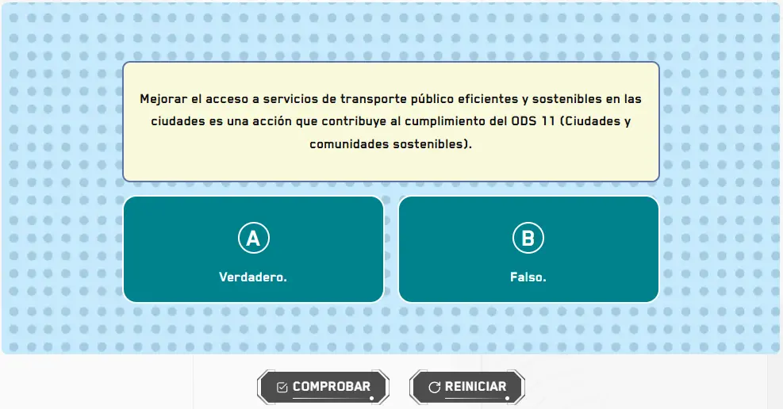

import CoreRepoInfo from '../../../components/CoreRepoInfo.astro';

`GameThisOrThat` es el componente raíz para crear preguntas interactivas de selección única agrupadas en niveles. Gestiona el estado de validación, resultado y reset de todas las opciones. Se compone de tres subcomponentes: `GameThisOrThat.Level`, `GameThisOrThat.Radio` y `GameThisOrThat.Button`.

## Vista previa



## Cómo implementar en un OVA

### 1. Importa los componentes

```tsx
import { useState } from 'react';
import { GameThisOrThat } from '@games/game-this-or-that';
import { useGamification } from '@features/gamification';
import { ToastFeedback } from '@features/toast-feedback';
import { Button } from '@ui';
```

---

### 2. Define las constantes

```tsx
const MODALS = {
  SUCCESS: 'modal-correct-activity',
  WRONG: 'modal-wrong-activity'
};

const LENGTH_QUESTION = 1; // total de niveles
```

---

### 3. Configura los hooks

```tsx
const [isOpen, setIsOpen] = useState<string | null>(null);

const { Modal, Stars, notifyReset, reportResult } = useGamification({
  id: 'ova-01-activity-1',
  total: LENGTH_QUESTION
});
```

:::tip[El `id` de gamificación debe ser único por actividad]
Cada actividad del proyecto debe tener un `id` diferente. Usa el patrón `ova-[número]-activity-[número]` para mantener consistencia.
:::

---

### 4. Crea el handler de validación

```tsx
const handleValidate = ({ result }: { result: boolean }) => {
  const activityResult = result ? 'SUCCESS' : 'WRONG';
  setIsOpen(MODALS[activityResult as keyof typeof MODALS]);

  reportResult({
    success: result,
    correct: LENGTH_QUESTION,
    total: LENGTH_QUESTION
  });
};

const closeModal = () => setIsOpen(null);
```

---

### 5. Construye la actividad

La actividad se arma en tres partes dentro de `<GameThisOrThat>`.

**5a. El nivel con su pregunta** — `GameThisOrThat.Level` recibe el texto de la pregunta en el prop `question` y envuelve las opciones de respuesta:

```tsx
<GameThisOrThat.Level question="Mejorar el acceso a servicios de transporte público eficientes y sostenibles en las ciudades es una acción que contribuye al cumplimiento del ODS 11.">
  {/* opciones van aquí */}
</GameThisOrThat.Level>
```

**5b. Las opciones** — cada `GameThisOrThat.Radio` es una opción seleccionable. Van dentro del `Level`:

```tsx
<GameThisOrThat.Level question="...">
  <GameThisOrThat.Radio id="option-1-1" state="wrong"   label="A. Verdadero." name="option-1" />
  <GameThisOrThat.Radio id="option-1-2" state="success" label="B. Falso."     name="option-1" />
</GameThisOrThat.Level>
```

> `state="success"` marca la opción correcta. `state="wrong"` las incorrectas. El `name` debe ser igual en todos los radios del mismo nivel — así solo se puede elegir uno. El `id` debe ser único en toda la página.

Si hay múltiples preguntas, agrega más bloques `Level`. El `name` de cada nivel debe ser diferente y usa `questionNumber` para numerar las preguntas visualmente:

```tsx
<GameThisOrThat onResult={handleValidate}>
  <GameThisOrThat.Level question="Primera pregunta..." questionNumber={1}>
    <GameThisOrThat.Radio id="option-1-1" state="wrong"   label="A. Verdadero." name="option-1" />
    <GameThisOrThat.Radio id="option-1-2" state="success" label="B. Falso."     name="option-1" />
  </GameThisOrThat.Level>

  <GameThisOrThat.Level question="Segunda pregunta..." questionNumber={2} backgroundImage="assets/images/bg-level-2.webp">
    <GameThisOrThat.Radio id="option-2-1" state="success" label="A. Verdadero." name="option-2" />
    <GameThisOrThat.Radio id="option-2-2" state="wrong"   label="B. Falso."     name="option-2" />
  </GameThisOrThat.Level>
</GameThisOrThat>
```

> `backgroundImage` acepta una ruta a imagen. Si se omite, el nivel usa el fondo por defecto definido en las constantes del juego.

**5c. Los botones de acción** — van al final, fuera de los `Level` pero dentro de `<GameThisOrThat>`:

```tsx
<Row justifyContent="center" alignItems="center" addClass="u-gap-4">
  <GameThisOrThat.Button>
    <Button label="COMPROBAR" variant="check" />
  </GameThisOrThat.Button>
  <GameThisOrThat.Button type="reset">
    <Button label="REINICIAR" onClick={notifyReset} variant="reset" />
  </GameThisOrThat.Button>
</Row>
```

**5d. Todo junto:**

```tsx
<GameThisOrThat onResult={handleValidate}>

  {/* 5a y 5b — nivel con sus opciones */}
  <GameThisOrThat.Level question="Mejorar el acceso a servicios de transporte público eficientes y sostenibles en las ciudades es una acción que contribuye al cumplimiento del ODS 11.">
    <GameThisOrThat.Radio id="option-1-1" state="wrong"   label="A. Verdadero." name="option-1" />
    <GameThisOrThat.Radio id="option-1-2" state="success" label="B. Falso."     name="option-1" />
  </GameThisOrThat.Level>

  {/* 5c — botones */}
  <Row justifyContent="center" alignItems="center" addClass="u-gap-4">
    <GameThisOrThat.Button>
      <Button label="COMPROBAR" variant="check" />
    </GameThisOrThat.Button>
    <GameThisOrThat.Button type="reset">
      <Button label="REINICIAR" onClick={notifyReset} variant="reset" />
    </GameThisOrThat.Button>
  </Row>

</GameThisOrThat>
```

---

### 6. Agrega los modales de feedback

```tsx
<Modal
  audio="assets/audios/content/aud_gr1_ova-01_sld-1 (Bien).mp3"
  interpreter={{ contentURL: 'content/vid_int_ova-01_sld-1 (Bien).mp4' }}
/>

<ToastFeedback
  type="wrong"
  isOpen={isOpen === MODALS.WRONG}
  onClose={closeModal}
  interpreter={{ contentURL: 'content/vid_int_ova-01_sld-1 (Incorrecto).mp4' }}
  audio="assets/audios/content/aud_gr1_ova-01_sld-1 (Incorrecto).mp3">
  <p>Revisa el contenido e intenta de nuevo.</p>
</ToastFeedback>

<ToastFeedback
  type="success"
  isOpen={isOpen === MODALS.SUCCESS}
  onClose={closeModal}
  interpreter={{ contentURL: 'content/vid_int_ova-01_sld-1 (Correcto).mp4' }}
  audio="assets/audios/content/aud_gr1_ova-01_sld-1 (Correcto).mp3">
  <p>¡Muy bien! Has respondido correctamente.</p>
</ToastFeedback>
```

---

## Subcomponentes

### `GameThisOrThat`

Contenedor raíz. Gestiona el estado global de todas las opciones y niveles.

| Prop | Tipo | Req. | Descripción |
|---|---|---|---|
| `onResult` | `({ result, options }) => void` | | Callback al comprobar. Recibe `result` (boolean) y el array de opciones seleccionadas |
| `minSelected` | `number` | | Mínimo de opciones seleccionadas para habilitar el botón Comprobar. Por defecto `1` |

<CoreRepoInfo corePath="components/games/game-this-or-that/game-this-or-that.tsx" />

---

### `GameThisOrThat.Level`

Agrupa la pregunta con sus opciones de respuesta. Puede haber múltiples niveles dentro de un `GameThisOrThat`.

| Prop | Tipo | Req. | Descripción |
|---|---|---|---|
| `question` | `string` | ✓ | Texto de la pregunta. Acepta HTML (ej: `<strong>`, `<em>`) |
| `questionNumber` | `number` | | Número visible de la pregunta. Útil cuando hay múltiples niveles |
| `backgroundImage` | `string` | | URL de la imagen de fondo del nivel. Si se omite usa el fondo por defecto |
| `addClass` | `string` | | Clases utilitarias adicionales para el contenedor del nivel |

<CoreRepoInfo corePath="components/games/game-this-or-that/game-this-or-that-level.tsx" />

---

### `GameThisOrThat.Radio`

Cada opción seleccionable dentro de un nivel.

| Prop | Tipo | Req. | Descripción |
|---|---|---|---|
| `id` | `string` | ✓ | Identificador único en toda la página |
| `name` | `string` | ✓ | Agrupa las opciones del mismo nivel. Igual en todos los radios del mismo `Level` |
| `label` | `string` | ✓ | Texto visible de la opción |
| `state` | `"success" \| "wrong"` | ✓ | Define si la opción es correcta o incorrecta |

> Debe haber exactamente un `state="success"` por nivel.

<CoreRepoInfo corePath="components/games/game-this-or-that/game-this-or-that-radio.tsx" />

---

### `GameThisOrThat.Button`

Botón de acción. Siempre debe ir dentro de `<GameThisOrThat>`.

| Prop | Tipo | Req. | Descripción |
|---|---|---|---|
| `type` | `"reset"` | | Sin valor comprueba y dispara `onResult`. Con `"reset"` deselecciona todas las opciones y reinicia el estado |

<CoreRepoInfo corePath="components/games/game-this-or-that/game-this-or-that-button.tsx" />
