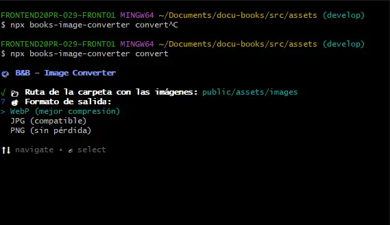
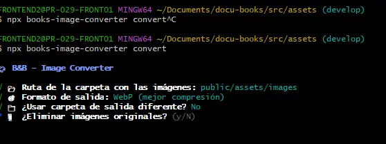

`books-image-converter` es una herramienta CLI para convertir imágenes entre diferentes formatos. Perfecta para preparar los assets de los OVAs — convierte lotes completos de imágenes a `.webp`, `.jpg` o `.png` con un solo comando.

## Instalación

No requiere instalación si usas `npx`:

```bash
npx books-image-converter convert
```

Si prefieres instalarlo globalmente para usarlo sin `npx`:

```bash
npm install -g books-image-converter
```

---

## Modos de uso

### Modo interactivo (recomendado)

La forma más fácil. Corre el comando y la CLI te guía paso a paso:

```bash
npx books-image-converter convert
```

**Paso 1** — Ingresa la ruta de la carpeta y elige el formato de salida navegando con las flechas del teclado:



**Paso 2** — Responde si quieres una carpeta de salida diferente y si deseas eliminar los originales:



Las preguntas en orden son:

1. **Ruta de la carpeta con las imágenes** — ej: `public/assets/images`
2. **Formato de salida** — navega con `↑ ↓` y confirma con `Enter`: `WebP` / `JPG` / `PNG`
3. **¿Usar carpeta de salida diferente?** — `Y/N`
4. **¿Eliminar imágenes originales?** — `Y/N`

---

### Modo comando (avanzado)

Para quienes prefieren pasar todo en una sola línea:

```bash
books-image-converter convert -i <carpeta-entrada> -f <formato>
```

---

## Opciones disponibles

| Opción | Alias | Descripción | Req. |
|---|---|---|---|
| `--input` | `-i` | Ruta de la carpeta con las imágenes a convertir | Sí* |
| `--format` | `-f` | Formato de salida: `webp`, `jpg` o `png` | Sí* |
| `--output` | `-o` | Carpeta de salida. Si se omite, usa la misma carpeta de entrada | No |
| `--delete` | `-d` | Elimina las imágenes originales después de convertir | No |

> *Solo requeridos en modo comando. En modo interactivo se solicitan automáticamente.

---

## Ejemplos

### Conversión básica a WebP

Convierte todas las imágenes de una carpeta a `.webp`:

```bash
npx books-image-converter convert -i ./imagenes -f webp
```

### Con carpeta de salida separada

Mantiene los originales y guarda las convertidas en otra carpeta:

```bash
npx books-image-converter convert \
  -i ./imagenes-originales \
  -f jpg \
  -o ./imagenes-convertidas
```

### Optimización web — WebP y eliminar originales

Convierte a `.webp` y elimina los originales para ahorrar espacio:

```bash
npx books-image-converter convert -i ./assets/images -f webp -d
```

### Conversión a PNG sin pérdida

```bash
npx books-image-converter convert -i ./fotos -f png
```

### Desde `package.json` — optimizar assets del OVA

Puedes agregar un script en el `package.json` para estandarizar el proceso:

```json
{
  "scripts": {
    "optimize:images": "books-image-converter convert -i ./public/images -f webp"
  }
}
```

---

## Cuándo usarlo en el proyecto

**Antes de subir assets al OVA** — convierte todos los `.png` o `.jpg` a `.webp` para reducir el peso de las imágenes y mejorar el rendimiento:

```bash
npx books-image-converter convert -i ./src/assets -f webp -d
```

**Para estandarizar formatos** — cuando recibes assets con mezcla de formatos (`.jpeg`, `.PNG`, `.gif`) y necesitas unificarlos:

```bash
npx books-image-converter convert -i ./coleccion-fotos -f png
```

---

## Formatos soportados

| Entrada | Salida |
|---|---|
| `.jpeg`, `.jpg` | `.webp` |
| `.png` | `.jpg` |
| `.gif` | `.png` |
| `.webp` | |

:::tip[Usa WebP para los assets de los OVAs]
`.webp` ofrece la mejor compresión con calidad visual similar a `.png` y `.jpg`. Es el formato recomendado para todas las imágenes de los OVAs. Usa `-d` para eliminar los originales una vez verificada la conversión.

```bash
npx books-image-converter convert -i ../../../public/assets/images -f webp -d
```
:::

:::caution[Verifica antes de eliminar originales]
Si usas `-d` (`--delete`), los archivos originales se eliminan permanentemente. Asegúrate de que la conversión fue correcta antes de usar esta opción, o trabaja sobre una copia:

```bash
# Primero convierte sin eliminar
npx books-image-converter convert -i ./assets -f webp

# Verifica el resultado, luego elimina manualmente los originales
```
:::