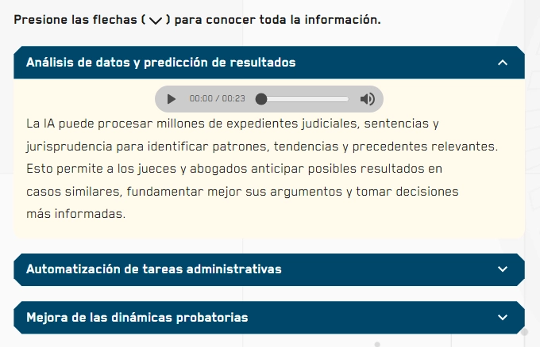

El componente `Accordion` permite mostrar y ocultar secciones de contenido, optimizando el espacio en pantalla y permitiendo al usuario enfocarse en información específica.

## Vista previa



## Cómo implementar

El acordeón utiliza un patrón de **Componentes Compuestos** para ofrecer flexibilidad total en la estructura del contenido.

### Ejemplo básico

```tsx
import { Accordion } from '@shared/components/ui';

const MyComponent = () => {
  return (
    <Accordion allowMultiple>
      <Accordion.Item>
        <Accordion.Button>
          <span>¿Qué es un OVA?</span>
        </Accordion.Button>
        <Accordion.Panel>
          <p>Un Objeto Virtual de Aprendizaje es un recurso digital estructurado...</p>
        </Accordion.Panel>
      </Accordion.Item>

      <Accordion.Item>
        <Accordion.Button>
          <span>Requisitos técnicos</span>
        </Accordion.Button>
        <Accordion.Panel>
          <p>Solo necesitas un navegador moderno y conexión a internet.</p>
        </Accordion.Panel>
      </Accordion.Item>
    </Accordion>
  );
};
```

---

## Parámetros

### `Accordion` (Contenedor)

| Prop | Tipo | Descripción |
|---|---|---|
| `allowMultiple` | `boolean` | Permite tener múltiples secciones abiertas simultáneamente. |
| `defaultIndex` | `number \| number[]` | Índice(s) de los items que deben iniciar abiertos. |

### `Accordion.Item`

| Prop | Tipo | Descripción |
|---|---|---|
| `addClass` | `string` | Clase CSS adicional para el contenedor del item. |
| `isDisabled` | `boolean` | Deshabilita la interacción con este item. |

### `Accordion.Button`

| Prop | Tipo | Descripción |
|---|---|---|
| `addClass` | `string` | Clase CSS adicional para el botón de toggle. |

### `Accordion.Panel`

| Prop | Tipo | Descripción |
|---|---|---|
| `addClass` | `string` | Clase CSS adicional para el contenedor del contenido. |

---

## Estructura de Clases CSS

El componente utiliza módulos CSS para asegurar el encapsulamiento de estilos:

- `.accordion-item`: Contenedor principal de cada sección.
- `.accordion-button`: Estilos para el encabezado interactivo.
- `.accordion-panel`: Estilos para el área de contenido (soporta animaciones de apertura).

## Accesibilidad

Este componente cumple con los estándares WAI-ARIA para acordeones:
- Los botones tienen los atributos `aria-expanded` automáticos según el estado.
- Relación `aria-controls` y `aria-labelledby` establecida internamente.
- Soporte completo para navegación por teclado (Space/Enter para abrir).
