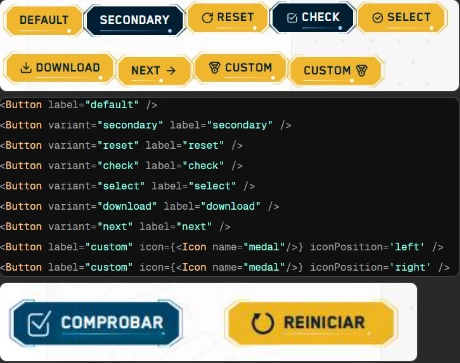

El componente `Button` es una evolución del botón base de la librería, añadiendo bordes decorativos con degradados y una gestión simplificada de iconos y variantes predefinidas.

## Vista Previa



## Cómo usar el Botón

### 1. Botón de Acción Sencillo

Para un botón estándar con texto:

```tsx
import { Button } from '@ui';

const Example = () => (
  <Button 
    label="Iniciar Actividad" 
    onClick={() => console.log('Click!')} 
  />
);
```

### 2. Uso con Variantes e Iconos Automáticos

El componente incluye variantes que configuran el icono automáticamente:

```tsx
<Button variant="check" label="Verificar" />
<Button variant="next" label="Siguiente" />
<Button variant="download" label="Descargar PDF" />
<Button variant="reset" label="Reiniciar" />
```

### 3. Personalización de Iconos

Puedes pasar cualquier icono de `lucide-react` o un componente personalizado:

```tsx
import { Play } from 'lucide-react';

<Button 
  label="Reproducir" 
  icon={<Play />} 
  iconPosition="right" 
  variant="secondary"
/>
```

---

## Parámetros

| Propiedad | Tipo | Descripción |
|---|---|---|
| `label` | `string` | El texto que se mostrará en el botón (también se usa para `aria-label`). |
| `variant` | `ButtonVariant` | El estilo del botón (`check`, `next`, `download`, `reset`, `select`, `bibliography`, `credits`, `secondary`, `disabled`). |
| `icon` | `ReactNode` | Icono personalizado que sobrescribe el de la variante. |
| `iconPosition` | `'left' \| 'right'` | Ubicación del icono respecto al texto. |
| `addClass` | `string` | Clases CSS adicionales. |
| `onClick` | `Function` | Función que se ejecuta al hacer clic. |

## Variantes Disponibles

| Variante | Icono por defecto | Descripción |
|---|---|---|
| `check` | `CircleCheckBig` | Usado para validación de actividades. |
| `next` | `ArrowRight` | Navegación a la siguiente sección (icono a la derecha por defecto). |
| `download` | `Download` | Descarga de recursos adicionales. |
| `reset` | `Icon(button-reset)` | Para reiniciar el estado de un juego. |
| `bibliography`| `FileText` | Apertura de referencias bibliográficas. |
| `credits` | `User` | Mostrar créditos del OVA. |

:::tip[Accesibilidad]
El componente incluye automáticamente `hasAriaLabel`, lo que ayuda a que los lectores de pantalla identifiquen la función del botón incluso si el label visual es corto.
:::
