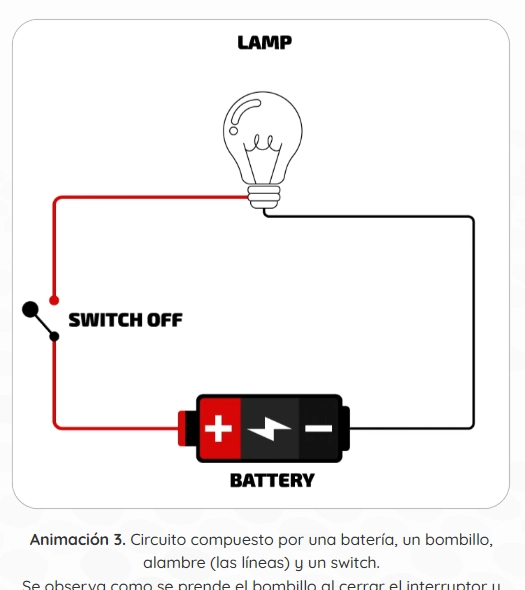

El componente `Gif` no utiliza archivos `.gif` reales, sino videos `.webm` en bucle. Esto mejora drásticamente el rendimiento y permite controlar la animación según las preferencias de accesibilidad del usuario.

## Vista Previa



## Cómo usar el Gif

### 1. Uso Estándar

Carga un video que se comportará como un gif (auto-play, bucle infinito, sin sonido):

```tsx
import { Gif } from '@ui';

const Example = () => (
  <Gif 
    src="assets/gifs/proceso-celular.webm" 
    alt="Diagrama animado que muestra el proceso de división celular."
    title="Proceso de mitosis"
    size="400px"
  />
);
```

### 2. Sin Leyenda (Caption)
Si no deseas que aparezca el texto debajo del gif:

```tsx
<Gif 
  src="assets/animations/decoracion.webm" 
  alt="Animación decorativa" 
  noCaption 
/>
```

---

## Parámetros

| Propiedad | Tipo | Descripción |
|---|---|---|
| `src` | `string` | URL del archivo de video (preferiblemente `.webm`). |
| `alt` | `string` | Descripción de la animación (soporta HTML si `hasHtml` es true). |
| `title` | `string` | Título que aparece en negrita arriba de la descripción. |
| `size` | `string` | Ancho máximo del componente (ej. "300px", "100%"). |
| `noCaption` | `boolean` | Si es `true`, oculta el título y la descripción inferior. |
| `hasHtml` | `boolean` | Indica si el texto del `alt` contiene etiquetas HTML. |

## Accesibilidad Inteligente

Este componente está profundamente integrado con el sistema de accesibilidad:

- **Movimiento Reducido:** Si el usuario tiene activo "Reducir Movimiento" en su sistema o en el panel de accesibilidad del OVA, el GIF se pausará automáticamente y mostrará controles de reproducción (Play/Pause).
- **Lectores de Pantalla:** Utiliza el `title` y el `alt` para generar un `aria-label` descriptivo en el elemento de video.
- **Limpieza de HTML:** Si `hasHtml` es true, el componente limpia las etiquetas para que los lectores de pantalla solo lean el contenido textual.

:::tip[Rendimiento]
Se recomienda el uso de formato `.webm` en lugar de `.gif` porque el peso de los archivos es hasta un 90% menor, lo que acelera la carga inicial del OVA.
:::
