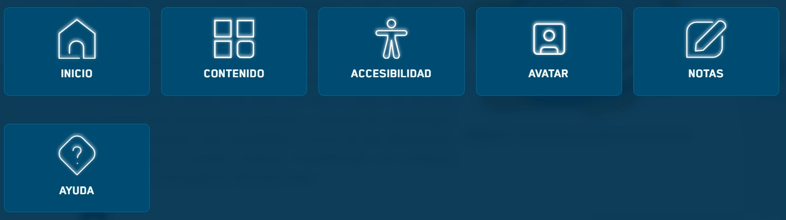

El componente `Icon` facilita la renderización de iconos SVG optimizados. Utiliza un sistema de **spritemap** para reducir las peticiones HTTP y mejorar el rendimiento.

## Vista previa



## Cómo implementar

Para usar un icono, simplemente necesitas pasar el nombre que deseas utilizar. Los nombres deben coincidir con los IDs definidos en el archivo `__spritemap.svg`.

### Ejemplo de uso

```tsx
import { Icon } from '@shared/components/ui';

const MyComponent = () => {
  return (
    <div className="u-flex u-gap-4">
      <Icon name="check" size="normal" />
      <Icon name="close" size="big" addClass="u-text-red-500" />
      <Icon name="arrow-right" size="small" />
    </div>
  );
};
```

---

## Parámetros

| Prop | Tipo | Descripción |
|---|---|---|
| `name` | `string` | **Requerido.** El nombre del icono dentro del spritemap (prefijo `icon-` omitido). |
| `size` | `'normal' \| 'big' \| 'small'` | Define las dimensiones predeterminadas del icono (Default: `normal`). |
| `addClass` | `string` | Clase CSS adicional para aplicar estilos personalizados (color, márgenes, etc.). |

---

## Funcionamiento técnico

El componente genera una etiqueta `<use>` que referencia a un elemento en el archivo de sprites:

```html
<svg>
  <use xlink:href="./__spritemap#icon-{name}" />
</svg>
```

:::tip[Color de los iconos]
Para cambiar el color de un icono, generalmente se utiliza la propiedad CSS `fill` o `color` (si el SVG usa `currentColor`) a través de la prop `addClass`.
:::

## Estilos Recomendados

Puedes usar clases de utilidad para personalizar el icono rápidamente:

```tsx
<Icon name="home" addClass="u-fill-primary u-w-10 u-h-10" />
```
