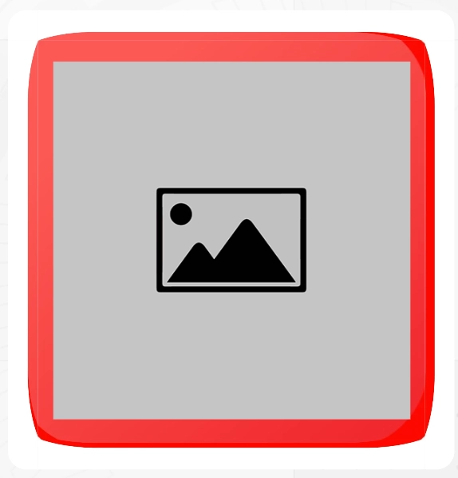

`ImgContainer` es un componente versátil diseñado para envolver contenidos (generalmente imágenes) y aplicar estilos complejos como marcos decorativos mediante `border-image`, dimensiones fijas y capas de profundidad.
    
## Vista previa



## Cómo implementar

El componente es agnóstico al contenido. Lo más común es usarlo junto con el componente `Image` para aplicar un marco o fondo específico.

### Ejemplo básico (con marco/fondo)

```tsx
import { ImgContainer, Image } from '@shared/components/ui';

const MyComponent = () => {
  return (
    <ImgContainer 
      background="assets/frames/vintage-frame.png" 
      width="300px"
      padding="20px"
    >
      <Image 
        src="assets/photo.jpg" 
        alt="Foto con marco" 
        size="100%" 
        noCaption 
      />
    </ImgContainer>
  );
};
```

---

## Parámetros

| Prop | Tipo | Descripción |
|---|---|---|
| `element` | `React.ElementType` | El elemento HTML que se renderizará (Default: `div`). |
| `width` | `string` | Ancho del contenedor (mapea a `--width`). |
| `height` | `string` | Alto del contenedor (mapea a `--height`). |
| `background` | `string` | URL de la imagen que se usará como fondo/borde (mapea a `--img-background`). |
| `padding` | `string` | Espaciado o grosor del borde (mapea a `--border-size`). |
| `backgroundSize` | `string` | Define el `borderImageWidth` si se usa como marco. |
| `zIndex` | `string` | Controla la profundidad de la capa. |
| `addClass` | `string` | Clase CSS adicional para estilos extra. |

---

## Funcionamiento técnico

Este componente basa su funcionamiento en **Variables CSS (Custom Properties)**. Al pasar las props, el componente inyecta estilos en línea que son consumidos por las clases definidas en `img-container.module.css`.

- **`--img-background`:** Utilizada generalmente en un pseudo-elemento o en la propiedad `border-image`.
- **`--border-size`:** Determina el espaciado interno que deja ver el fondo.

### Flexibilidad Semántica
Gracias a la prop `element`, puedes transformar el contenedor en una etiqueta más semántica si es necesario:

```tsx
<ImgContainer element="section" addClass="u-my-4">
  {/* Contenido */}
</ImgContainer>
```
