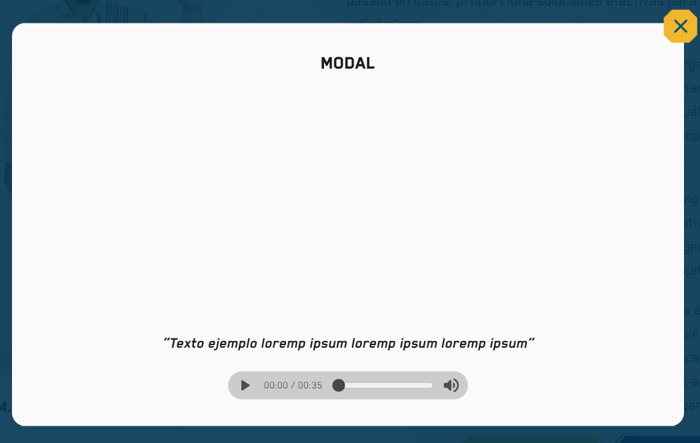

El componente `Modal` proporciona una ventana emergente que bloquea la interacción con el fondo. Está diseñado para ser accesible y puede sincronizarse automáticamente con el Intérprete de Señas.

## Vista Previa



## Cómo usar el Modal

### 1. Implementación Básica

Necesitas un estado para controlar si el modal está abierto o cerrado:

```tsx
import { useState } from 'react';
import { Modal } from '@ui';

const Example = () => {
  const [isOpen, setIsOpen] = useState(false);

  return (
    <>
      <button onClick={() => setIsOpen(true)}>Abrir Información</button>
      
      <Modal isOpen={isOpen} onClose={() => setIsOpen(false)}>
        <h2>Título del Modal</h2>
        <p>Este es el contenido que aparecerá dentro de la ventana.</p>
      </Modal>
    </>
  );
};
```

### 2. Con Intérprete de Señas
Puedes especificar qué videos debe cargar el intérprete mientras el modal esté abierto:

```tsx
<Modal 
  isOpen={isOpen} 
  onClose={handleClose}
  interpreter={{
    contentURL: 'videos/interprete/explicacion-modal.mp4',
    a11yURL: 'videos/interprete/a11y-modal.mp4'
  }}
>
  <p>Contenido con apoyo de LSC.</p>
</Modal>
```

---

## Parámetros

| Propiedad | Tipo | Descripción |
|---|---|---|
| `isOpen` | `boolean` | Determina si el modal es visible. |
| `onClose` | `Function` | Función que se ejecuta al cerrar el modal (clic en X, fondo o Esc). |
| `size` | `'xs' \| 'sm' \| 'md' \| 'lg' \| 'xl'` | Ancho máximo del modal. |
| `interpreter`| `VideoURLs` | Objeto con las URLs para el intérprete de señas. |
| `addClass` | `string` | Clases CSS adicionales para el contenedor de contenido. |

## Características Técnicas

- **Foco Automático:** Al abrirse, el foco se mueve dentro del modal (Focus Trap).
- **Cierre Inteligente:** Soporta cierre mediante la tecla `Escape` y haciendo clic en el `Overlay` (fondo oscuro).
- **Sincronización:** Si se pasan `interpreter` URLs, estas se restauran automáticamente al cerrar el modal a las que estaban antes de abrirlo.

:::warning[Accesibilidad]
Asegúrate de que el título dentro del modal (ej. un `<h2>`) sea descriptivo para que los usuarios con lectores de pantalla comprendan el contexto de la nueva ventana.
:::
