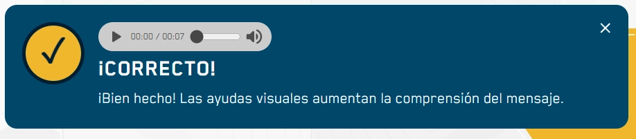

El sistema de notificaciones se divide en dos componentes: `Toast` para mensajes genéricos y `ToastFeedback` para retroalimentación de actividades con estilos predefinidos y soporte de audio.

## Toast (Base)

Componente base que utiliza un Portal para renderizarse sobre el contenido principal. Incluye soporte para el intérprete de señas y trampa de foco.

### Cómo implementar

```tsx
import { useState } from 'react';
import { Toast } from '@shared/components/ui';

const MyComponent = () => {
  const [isOpen, setIsOpen] = useState(false);

  return (
    <>
      <button onClick={() => setIsOpen(true)}>Abrir Toast</button>
      
      <Toast isOpen={isOpen} onClose={() => setIsOpen(false)}>
        <p>Este es un mensaje informativo genérico.</p>
      </Toast>
    </>
  );
};
```

### Parámetros Toast

| Prop | Tipo | Descripción |
|---|---|---|
| `isOpen` | `boolean` | Controla la visibilidad del componente. |
| `onClose` | `() => void` | Función que se ejecuta al cerrar (botón X o Escape). |
| `addClass` | `string` | Clase CSS adicional para el contenedor. |
| `label` | `string` | Etiqueta de accesibilidad (aria-label). |
| `interpreter` | `VideoURLs` | Configuración de videos para el intérprete de señas. |

---

## ToastFeedback

Extensión del `Toast` diseñada específicamente para actividades. Cambia su estilo visual según el resultado (éxito/error) y puede reproducir un audio de retroalimentación.

## Vista Previa



---

### Cómo implementar

```tsx
import { useState } from 'react';
import { ToastFeedback } from '@shared/components/features';

const MyActivity = () => {
  const [feedback, setFeedback] = useState<{ open: boolean, type: 'success' | 'wrong' }>({
    open: false,
    type: 'success'
  });

  return (
    <ToastFeedback 
      isOpen={feedback.open} 
      type={feedback.type}
      onClose={() => setFeedback({ ...feedback, open: false })}
      audio="assets/audio/success.mp3"
    >
      <p>¡Buen trabajo! Has completado el desafío.</p>
    </ToastFeedback>
  );
};
```

### Parámetros ToastFeedback

| Prop | Tipo | Descripción |
|---|---|---|
| `type` | `'success' \| 'wrong'` | Define el estilo visual y el icono (Default: `success`). |
| `label` | `string` | Título del mensaje (Si no se provee, usa i18n por defecto). |
| `audio` | `string` | Ruta al archivo de audio que se reproducirá. |
| `...props` | `ToastCoreProps` | Hereda todas las props del componente `Toast`. |

---

## Características de Accesibilidad

- **Trampa de Foco:** Utiliza el hook `useFocusTrap` para mantener la navegación por teclado dentro de la notificación abierta.
- **Roles ARIA:** Posee `role="dialog"` y `aria-modal="true"`.
- **Intérprete:** Se integra con el sistema de señas global, cambiando las fuentes de video automáticamente al abrirse.
