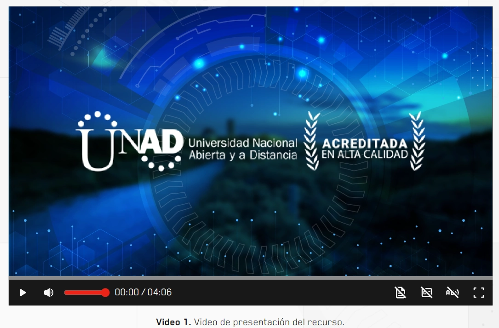

El componente `Video` es un contenedor estilizado para el reproductor base de la librería, añadiendo un sistema de marcos (`figure`) y leyendas (`figcaption`) estandarizadas para el proyecto.

## Vista Previa



## Cómo usar el Video

### 1. Implementación Estándar

```tsx
import { Video } from '@ui';

const Example = () => (
 <Video
            title="Video 1."
            alt="Video de presentación del recurso."
            src="assets/videos/VIDEO_1.mp4"
            audio="assets/videos/audio_video_1.mp3"
            caption={{
              src: 'assets/videos/subtitulos_video_1.vtt',
              lang: 'es'
            }}
          />
);
```

---

## Parámetros

| Propiedad | Tipo | Descripción |
|---|---|---|
| `src` | `string` | URL del archivo de video. |
| `alt` | `string` | Descripción detallada del video (aparece en el pie de página). |
| `title` | `string` | Título del video (aparece en negrita antes del `alt`). |
| `poster` | `string` | Imagen de previsualización que aparece antes de dar Play. |
| `controls` | `boolean` | Indica si se muestran los controles de reproducción. |
| `caption` | `object` | Subtitulos del video. |

## Detalles del Componente

- **Ruta del Poster por Defecto:** Si no se proporciona un `poster`, el componente intentará cargar `"assets/base/poster.webp"`.
- **Estructura Semántica:** Utiliza las etiquetas `<figure>` y `<figcaption>` para mejorar el SEO y la accesibilidad, vinculando visual y estructuralmente el video con su descripción.

:::tip[Accesibilidad]
El campo `alt` no solo es visual; es lo que los estudiantes con discapacidad visual usarán para entender de qué trata el video antes o después de reproducirlo. Sé descriptivo.
:::
